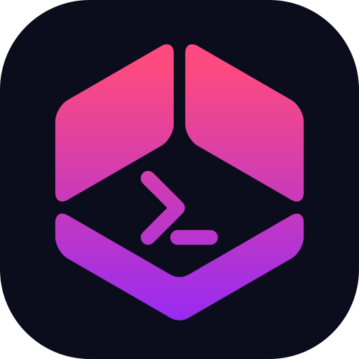

<p align="center">
  
</p>

<h1 align="center">rozi</h1>

<p align="center">
  A modern tiling terminal multiplexer for Linux, macOS, and Windows.
</p>

<p align="center">
  <a href="https://rozi.tui-lipan.dev">Website</a>
  ·
  <a href="https://github.com/tui-lipan/rozi/actions/workflows/ci.yml">CI</a>
  ·
  <a href="LICENSE">MPL-2.0</a>
</p>

<p align="center">
  
</p>

rozi arranges terminal panes with tiling layouts, floating panes, fullscreen panes, and nine
workspaces. A prefix key controls panes without taking ordinary input away from the programs
inside them. Named sessions keep running when the client detaches, so you can return to the same
processes and scrollback later. Tiling behavior and keyboard flow take their cues from the
[Hyprland](https://hypr.land) window manager.

## Install

```bash
curl -fsSL https://rozi.tui-lipan.dev/install | bash
```

```powershell
irm https://rozi.tui-lipan.dev/install.ps1 | iex
```

You can also install with Cargo:

```bash
cargo install rozi
```

Building from source requires Rust 1.90 or newer. See [Installation](docs/installation.md) for
PATH setup, updates, rollback, and source builds.

## First five minutes

Run `rozi`. The session picker opens without creating or attaching to a session.

For a shell you can discard, press `Enter` or `Ctrl+T`. For work you want to return to, type a
session name such as `dev` and press `Ctrl+N`.

The default prefix is `Ctrl+A`. Press it, release it, then press the command key:

| Keys | Action |
| --- | --- |
| `Ctrl+A`, `Enter` | Split the focused pane |
| `Ctrl+A`, `h` / `j` / `k` / `l` | Move focus |
| `Ctrl+A`, `p` | Open the command palette |
| `Ctrl+A`, `?` | Show active keybindings |
| `Ctrl+A`, `d` | Detach from a named session |

Attach to the named session again with:

```bash
rozi attach dev
```

## Documentation

- [Overview](docs/overview.md)
- [Getting started](docs/getting-started.md)
- [Feature map](docs/features.md)
- [Core concepts](docs/core-concepts.md)
- [Keybindings](docs/keybindings.md)
- [Configuration](docs/configuration.md)
- [Platform support](docs/platform-support.md)

The [documentation index](docs/index.md) links to every guide.

## Platforms

rozi supports Linux, macOS, and Windows. Windows requires Windows 10 version 1809 or newer.
Some process inspection and shell integration details differ by platform. See
[Platform support](docs/platform-support.md).

## Contributing

Contributions require a Developer Certificate of Origin sign-off. See
[CONTRIBUTING.md](CONTRIBUTING.md).

## License

rozi is licensed under the [Mozilla Public License 2.0](LICENSE).
