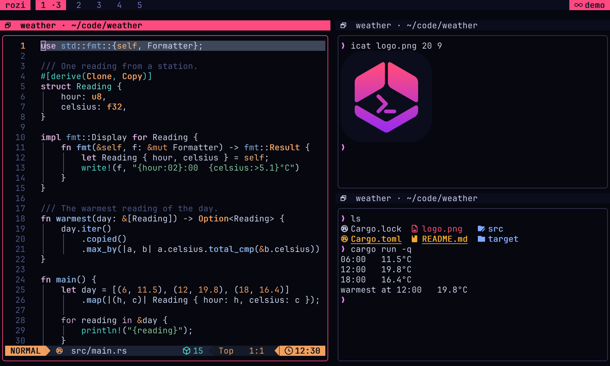

# Control CLI

This is the reference for the `rozi` commands that inspect and drive a running rozi: listing panes,
typing into them, reading their output, rearranging the layout, and showing pickers and toasts. It
is for anyone writing shell scripts, hooks, services, or extensions. For a gentler start, read
[Scripting](scripting.md); to write a client that speaks the wire format directly, see
[Control protocol](control-protocol.md).

```sh
rozi list-panes                                   # the panes in the rozi you are running
rozi split --title Tests --argv cargo test        # open a pane running a program
rozi --session dev capture-pane --target 3        # read a pane in a session nobody is viewing
```

## Two endpoints

A control command talks to one of two places, called its _endpoint_:

- **A running UI** — the rozi window you are looking at. It can do everything, including moving
  focus and drawing pickers and toasts.
- **A named session server** — the background process that keeps a session's panes alive (see
  [Sessions and clients](core-concepts.md#sessions-and-clients)). Select it with
  `--session <NAME>`. It needs no window at all, so a detached session can be listed, captured,
  typed into, and given new panes from a cron job or an SSH login.

| Endpoint | Selected by | Serves |
| --- | --- | --- |
| A running UI | `--socket`, `ROZI_SOCKET`, or discovery | Every command. |
| A named session server | `--session <NAME>` | The commands a server can answer without a screen. |

```sh
rozi --session dev list-panes
rozi --session dev capture-pane --target 3
rozi --session dev send-keys --target 3 'cargo test' Enter
rozi --session dev split --workspace 9 --argv cargo watch -x test
```

Both endpoints return the same `{ok, code, data, error}` document and the same tables, so a script
reads one format either way. `code` appears on failures and is stable for automation.

A session endpoint gives a script no authority an attached client would not have. Opening a pane
still needs layout control to be free (only one client at a time holds it; see
[Shared sessions](shared-sessions.md)), typing still respects the session's input lock, and a
request made on behalf of an extension is refused (see
[Extensions and detached sessions](#extensions-and-detached-sessions)).

The commands marked `no` in the [command table](#commands) need a UI. Against a session they fail
with a message saying why: focus, the active workspace, toasts, pickers, actions, and `capture-ui`
belong to a UI, and a session server has no screen.

`--session` and `--socket` name different endpoints and cannot be combined. A bare session name
is a launch target, not a control target: `rozi dev` starts a UI, so `rozi dev list-panes` is
refused and suggests `--session dev` instead.

### Sessions on another machine

Add `--remote <HOST>` to reach a named session on another machine:

```bash
rozi --remote workbox --session dev list-panes
rozi --remote workbox --session dev agents prompt --target 3 --wait idle "run the tests"
```

Every command a local session answers, a remote one answers the same way, with the same output and
the same exit status. The request is forwarded over SSH and the answer is rendered locally, so a
remote command in a terminal prints the same table a local one does.

It uses the same SSH connection as [remote attach](remote.md): saved hosts, connection
multiplexing, the discovered remote binary, and the same askpass rules. There is no daemon, network
port, or account. `--remote` without `--session` is refused, because a control command addresses a
session server and the far host's UI is not one.

`agents wait` and `agents prompt --wait` run on the remote session server and keep their own
deadline; the SSH hop does not cut them short.

The remote host needs a rozi that supports forwarding. An older one is reported as a version
mismatch rather than a broken command. Run `rozi api describe` there and look for `remote-control`
in its capabilities.

## Endpoint discovery

Without `--session`, control commands choose a UI endpoint in this order:

1. `--socket PATH`
2. `ROZI_SOCKET`
3. The only live control endpoint in the runtime directory

Discovery fails if the runtime directory contains no live endpoints or more than one. Pass
`--socket` when several UIs are running. Put `--socket PATH` before the command.

| Platform | Endpoint named by `ROZI_SOCKET` |
| --- | --- |
| Linux | Unix-domain socket under `$XDG_RUNTIME_DIR/rozi`, `/run/user/<uid>/rozi`, or a private per-user temporary directory |
| macOS | Unix-domain socket in rozi's private runtime directory |
| Windows | Discovery entry under `%LOCALAPPDATA%\rozi\run` for a current-user named pipe |

On Windows, pass the discovery-entry path to the CLI. Do not read the entry or construct a pipe
name yourself.

Every local pane receives `ROZI=1` and `ROZI_PANE`, plus `ROZI_SOCKET` and `ROZI_BIN` when control
is available. Remote panes do not receive the local client's `ROZI_SOCKET` or `ROZI_BIN`, and
neither does a pane opened by `rozi --session <NAME> split`, because there is no UI for them to
name. Such a pane still reaches its own session with `rozi --session <NAME>`.

## Target selection

Commands that accept `--target` use it first.

Against a **UI endpoint**, the CLI otherwise sends the calling pane's `ROZI_PANE`, and rozi falls
back to the focused pane.

Against a **session endpoint**, `ROZI_PANE` is ignored. A pane id does not say which session it
belongs to, so a script in pane 3 of `work` running `rozi --session dev send-text …` would
otherwise type into pane 3 of `dev`. A session endpoint uses `--target`, or the only pane of a
one-pane session, and otherwise fails with the ids to choose from:

```text
session `dev` has 3 panes and no focused pane; pass --target (ids: 1, 2, 5)
```

`agents report` and `agents release` always require `--target` with `--session`, even for a
one-pane session.

A pane addressing its own session names itself:

```sh
rozi --session dev status working --target "$ROZI_PANE"
```

Target a pane explicitly when a script drives a pane it created:

```sh
ROZI_CMD=${ROZI_BIN:-rozi}
pane=$("$ROZI_CMD" split --workspace 9 --argv bash | jq -r '.data.id')
"$ROZI_CMD" send-text --target "$pane" 'printf "ready\n"'
"$ROZI_CMD" send-keys --target "$pane" Enter
```

Input sent while a pane's process is starting is queued. Input to an exited or failed process is
rejected.

## Commands

The `--session` column says whether the command also works against a session server with no UI
attached.

| Command | Purpose | `--session` |
| --- | --- | --- |
| `list-panes [--format text\|json]` | List panes visible to this endpoint. | yes |
| `layout get [--workspace 1-9] [--format text\|json]` | Report workspaces and where each pane sits. | yes |
| `layout set --workspace 1-9 [<LAYOUT>] [--master-ratio R] [--if-revision N]` | Set a workspace's tiling layout, its master share, or both. | yes |
| `pane set --target ID [--floating B] [--fullscreen B] [--rect X,Y,W,H \| --rect-fraction X,Y,W,H] [--split-ratio R \| --width-ratio R] [--if-revision N]` | Float, tile, place, size, or fullscreen a pane. | yes |
| `pane move --target ID --workspace 1-9 [--if-revision N]` | Move a pane to another workspace. | yes |
| `pane swap --target ID --with ID [--if-revision N]` | Exchange two tiled panes. | yes |
| `pane close --target ID [--if-revision N]` | Close a pane without asking. | yes |
| `agents list [--format text\|json]` | List effective agent runtimes and exact references. | yes |
| `agents get TARGET [--format text\|json]` | Read one semantic agent record. | yes |
| `agents read TARGET [--scrollback N\|full] [--format text\|json]` | Capture an agent's terminal. | yes |
| `agents wait TARGET --until STATE [--timeout DURATION] [--format text\|json]` | Wait atomically for semantic state. | only |
| `agents prompt TARGET [--wait STATE] [--timeout DURATION] [--allow-working] [--format text\|json] TEXT` | Validate, submit, and optionally wait atomically. | only |
| `agents report --agent ID --integration TOKEN --state STATE --seq N [--reason TEXT] [--native-session ID] [--target ID]` | Publish incarnation- and sequence-fenced native agent state. | yes |
| `agents release --integration TOKEN --seq N [--target ID]` | Release integration authority. | yes |
| `metrics [--format text\|json]` | Read bounded client and cached server resource counters. | yes |
| `focus <PANE_ID>` | Focus a pane. | no |
| `send-text [--target <PANE_ID>] [WAIT] [--capture text\|ansi\|png\|spans] <TEXT>` | Send literal UTF-8 text. | yes |
| `send-keys [--target <PANE_ID>] [-l\|--literal] [WAIT] [--capture text\|ansi\|png\|spans] [--] <KEY\|TEXT>...` | Send named keys and text. | yes |
| `split [OPTIONS] [COMMAND \| --argv PROGRAM [ARG...]]` | Open a pane. | yes |
| `run-action <ACTION_ID>` | Run a built-in, configured, or extension command ID. | no |
| `capture-pane [--target ID] [--scrollback N\|full] [--last-output] [--render text\|ansi\|png\|spans] [--scale 1-3] [--image-pixels] [WAIT] [--output FILE] [--format text\|json]` | Capture a pane as text, ANSI, PNG, or styled runs. | yes |
| `capture-ui [--render text\|ansi\|png\|spans] [--scale 1-3] [--image-pixels] [--output FILE] [--format text\|json]` | Capture the whole UI as it is drawn. | no |
| `record start [pane] --target ID --output FILE [--max-fps N] [--duration DUR] [--max-bytes SIZE] [--force]` | Start recording a pane. | only |
| `record pane --target ID --output FILE [OPTIONS]` | Record a pane until `Ctrl+C`. | only |
| `record list [--format text\|json]` | List running recordings. | only |
| `record mark TEXT [--id ID]` | Label the current moment of running recordings. | only |
| `record stop [--id ID]` | Stop a recording once its file is complete. | only |
| `record export FILE --to png-frames DIR [--scale 1-3] \| --to cast OUT [--force]` | Export a recording. | — |
| `record play FILE [--speed N] [--from MARK\|TIME]` | Replay a recording in this terminal. | — |
| `switch-workspace <1-9>` | Switch the active workspace. | no |
| `move-to-workspace <1-9>` | Move the focused pane. | no |
| `status [--target <PANE_ID>] <VALUE> [--reason TEXT]` | Report status for a pane. | yes |
| `status --clear [--target <PANE_ID>]` | Clear reported status. | yes |
| `notify <MESSAGE> [--title TEXT] [--level info\|error]` | Show a toast. | no |
| `subscribe [EVENT...]` | Stream events as NDJSON. An empty list subscribes to all events. | no |
| `pick [--title TEXT] [--placeholder TEXT] [--json]` | Open a modal picker using stdin and stdout. | no |
| `publish` | Publish Activity rows over stdin and receive activations on stdout. | no |
| `api describe` | Print the API versions and capabilities of the installed binary. | — |

`layout set` and the `pane` commands also accept `--format text|json`. `WAIT` is
`[--wait-for TEXT] [--settle DURATION] --timeout DURATION`; see [Wait for output](#wait-for-output).

In the `agents` rows, `TARGET` is `--target ID` (a pane id) or `--ref JSON` (an exact agent
reference from `agents list`). `agents wait` and `agents prompt` run inside the session server, so
they need `--session` and are refused against a UI. See
[Inspect and wait for agents](agents.md#inspect-and-wait-for-agents) for states, references, and
integration reports.

The `record` commands that record run inside the session server, so they need `--session` and are
refused against a UI. `record export` and `record play` read a file and take no endpoint. See
[Record a pane](recording.md).

Control commands reject the launch-only options `--config`, `--read-only`, `--profile`, `--pick`,
and `--cwd`. `--session <NAME>` is the one target they accept, optionally qualified by
`--remote <HOST>`.

### Check the installed API

`rozi api describe` prints the control API version, [schema](#json-schema) version, session
protocol version, and capabilities of the installed binary. It does not connect to a UI or session:

```json
{
  "api": 1,
  "schema": 8,
  "session_protocol": 18,
  "capabilities": [
    "agent-waits",
    "attached-control",
    "capture-render",
    "capture-scale",
    "capture-spans",
    "capture-ui",
    "capture-wait",
    "layout-control",
    "pane-control",
    "published-activity",
    "record-pane",
    "remote-control",
    "session-control"
  ]
}
```

`schema` is the version of the JSON schema and changes independently of `session_protocol`, which
only concerns how two rozi binaries talk to each other.

## Output and exit status

`list-panes`, `layout get`, `metrics`, `capture-pane`, `capture-ui`, and `record list` print human-readable output
to a terminal and stable JSON when redirected. Use `--format text` or `--format json` to choose
explicitly.

Other successful one-shot commands print a short acknowledgement on a terminal and the JSON
response when redirected. A failure prints its error to stderr; with JSON output, the failure
document is also written to stdout.

| Exit status | Meaning |
| --- | --- |
| `0` | The command succeeded. |
| `1` | The command was invalid or refused, the reply had `ok: false`, a [wait](#wait-for-output) timed out, or a capture could not be written. |
| `2` | No endpoint was reached: discovery failed, the connection failed, the reply was empty or not JSON, or a PNG was about to be written to a terminal. |

`pick` has its own statuses; see [Pickers](#pickers).

`list-panes` describes only the endpoint that answered. From a UI, it includes the current
attachment and client-local scratch panes, not every named session. From `--session`, it includes
every pane in that session, including panes whose process has exited, which report
`exited (<CODE>)` instead of `ready`. Use `rozi sessions list` to discover session servers.

Human-readable help and reports use rozi's palette when written to a terminal; redirected output
stays plain. `NO_COLOR`, `CLICOLOR=0`, and `TERM=dumb` disable styling. `CLICOLOR_FORCE` enables it
for a consumer that renders ANSI color from a pipe. JSON, `publish` and `subscribe` streams, and
version output are never styled. The one-shot detach summary uses the same palette when rozi
restores the terminal.

## JSON schema

Every shape on this page is described by
[`docs/schema/rozi-control-v1.schema.json`](https://github.com/tui-lipan/rozi/blob/master/docs/schema/rozi-control-v1.schema.json):
requests, the response envelope, error codes, each command's `data` payload, published activity
rows, agent records and references, and the event envelope.

The schema is generated from the source, so it always matches the binary it ships with.
Contributors regenerate it with:

```bash
cargo run --features schema-gen --bin rozi-api-schema
```

Two conventions matter when you validate against it:

- **Objects accept unknown properties.** Responses gain fields over time, and a client validating
  against an older copy keeps working. Do not reject a document for carrying a field you do not
  recognize.
- **Enumerations are closed.** Error codes, agent states, wait conditions, and event names are
  fixed vocabularies. A new value is an API change and moves the schema version. The file name
  follows the control API version, so `rozi-control-v1.schema.json` keeps its name while
  `x-rozi-schema-version` counts its revisions.

`ControlResponse.data` is untyped in the envelope, because one envelope carries every command's
answer. The schema names each payload separately — `PaneInfo`, `AgentInfo`, `PaneCapture`,
`AgentWaitResult`, and the rest — so pick the one for the command you sent.

## Open a pane

`split` opens a pane. It leaves focus unchanged unless `--focus` is present.

| Option | Effect |
| --- | --- |
| `--cwd DIR` | Start the pane in `DIR`. |
| `--title TEXT` | Set the pane title. |
| `--workspace 1-9` | Open the pane in that workspace. |
| `--focus` | Focus the new pane. |
| `--keep-open` | Keep the pane after its process exits. |
| `--argv PROGRAM [ARG...]` | Run a program directly, without a shell. |

A positional `COMMAND` is interpreted by the configured `command_shell`. `--argv` launches a
program directly and consumes all remaining arguments, so every pane option must come before it.

```sh
rozi split --cwd "/repo with spaces" --title Tests --keep-open 'cargo test'
rozi split --workspace 9 --focus --argv cargo test -- --nocapture
```

The reply waits up to five seconds for the pane's process to be ready. `pty_ready: false` means the
pane exists but has not reported ready yet.

### Open a pane in a detached session

With `--session`, the server places the pane itself, so a client attaching later finds it already
in the layout. `[[rules]]` apply exactly as they do to a pane a person opens: a rule may float the
pane, make it fullscreen, and choose its workspace, and an explicit `--workspace` still wins over
the rule. Without either, the pane lands in workspace 1. The workspace's tiling arrangement is left
alone: the new pane is tiled beside the others when a client draws it, and a split ratio you set
survives.

`[[rules]]` and the configured shell are read from the server's config at the moment of the
`split`, so an edited rule applies to the next one without restarting the session.

A session endpoint refuses `split` when:

- **Another client holds layout control.** Detach it, or open the pane from that client. Reading
  and typing do not need layout control and keep working.
- **`--focus` is given.** There is no focus to move.
- **The session has panes but no layout.** This happens only if no client ever attached to place
  them.

A pane opened this way receives only `ROZI` and `ROZI_PANE`. It does not get `ROZI_SOCKET` or
`ROZI_BIN`, since there is no UI, and it does not inherit desktop variables such as `DISPLAY`,
`WAYLAND_DISPLAY`, or anything `[environment] forward` adds from the short-lived CLI process.

## Layout

`layout get` reports every workspace and where each of its panes sits. `--workspace N` narrows the
report to one workspace.

```sh
rozi layout get --format json
rozi --session dev layout get --workspace 2 --format json
```

The report keeps two questions apart:

- **How the session is arranged.** `workspaces` describes the session's shared layout. The session
  server owns it and every client follows it, so both endpoints give the same answer.
- **What one UI shows.** `client` and each pane's `view_rect` describe a single UI's screen: its
  focus, the workspace it shows, and where it draws each pane. They appear only when a UI answered.

Each accepted change to the shared layout gets a new, increasing _revision_ number. Scripts use it
to detect changes made by someone else (see [Changing the layout](#changing-the-layout)). A client
that follows another client's layout reports the layout it last received; the controlling client
reports the one it commits.

```json
{
  "session": "dev",
  "revision": 18,
  "canvas": { "cols": 160, "rows": 47 },
  "workspaces": [
    {
      "index": 1,
      "name": null,
      "layout": "dwindle",
      "synchronized": false,
      "panes": [
        {
          "id": 7,
          "reference": { "session_instance": "…", "pane_id": 7, "generation": 1 },
          "order": 0,
          "floating": false,
          "fullscreen": false,
          "rect": { "x": 0, "y": 0, "width": 96, "height": 47 },
          "rect_fraction": { "x": 0.0, "y": 0.0, "width": 0.6, "height": 1.0 },
          "view_rect": { "x": 0, "y": 1, "width": 95, "height": 46 }
        }
      ]
    }
  ],
  "client": {
    "active_workspace": 1,
    "focused_pane": 7,
    "controller": true,
    "committed": true,
    "viewport": { "cols": 160, "rows": 48 }
  }
}
```

| Field | Meaning |
| --- | --- |
| `revision` | The layout revision described. Null until something places a pane. A controlling UI first sends any change it is still holding back, and reports the revision that change will have. |
| `canvas` | The shared canvas that `rect` is measured against: the pane area of the client that last controlled the layout. |
| `workspaces` | Every workspace in the layout, including empty ones, so a script can see a workspace's layout before using it. `index` is one-based. A UI always reports all nine. A layout the server started for a headless `split` holds only the workspaces it placed panes in; the others take each client's configured default layout. |
| `layout` | `dwindle`, `master`, `grid`, `columns`, `rows`, `scrollable`, or `monocle`. |
| `master_ratio` | Master workspaces only: the master pane's share of the width. |
| `order` | The pane's position in the tiling order that every layout except Dwindle arranges panes in. Null for a floating pane. |
| `rect` | Where the pane sits on the shared canvas, in whole cells. Gaps, borders, and the workbar are left out, because each client draws those differently. |
| `rect_fraction` | The pane's position as fractions of the canvas, rounded to six decimal places. Floating panes are stored this way, so their fractions are exact. |
| `split_ratio` | Dwindle workspaces only: the pane's share of the split that directly holds it. Absent for a floating pane or a lone tile. |
| `width_ratio` | Scrollable workspaces only: the pane's column width as a fraction of the viewport. |
| `view_rect` | Where this UI draws the pane, in cells of its own terminal, gaps and chrome included. Only for panes in the workspace the UI shows. |
| `unplaced_panes` | Session endpoint only: panes the server runs that no layout places yet. |
| `client.controller` | Whether this UI holds layout control. A UI without a shared session controls its own layout. |
| `client.committed` | False until the server has confirmed `revision`. A controlling UI sends a change without waiting for the confirmation. |

Tiled panes are listed in tiling order, then floating panes. Some geometry needs care:

- **Scrollable:** the strip of columns can be wider than the canvas, so a `rect` can extend past
  the right edge and `rect_fraction` can exceed `1.0`. The shared `rect` always starts the strip at
  its first column; `view_rect` shows where this UI has scrolled it to follow focus.
- **Monocle:** every tiled pane has the same `rect`. The focused one is drawn on top.
- **Fullscreen:** `rect` is where the pane returns to afterwards. `view_rect` covers the screen
  while it is fullscreen.
- **Followers:** a client that follows another centres the controller's canvas in its own window,
  so its `view_rect` values can start at a negative position or run past its edges.

### Changing the layout

`layout set` chooses a workspace's tiling layout. `pane set` floats, tiles, places, sizes, or
fullscreens one pane. `pane move`, `pane swap`, and `pane close` move a pane to another workspace,
exchange two panes, and close one.

```sh
rozi layout set --workspace 2 master
rozi pane set --target 7 --floating true --rect 10,5,80,24
rozi pane set --target 7 --fullscreen true
rozi --session dev pane set --target 3 --floating false --if-revision 18
```

Every write names what it changes: `layout set` needs `--workspace`, and every `pane` command needs
`--target`. Neither falls back to focus or `ROZI_PANE`, and neither moves focus.

A write sets a state rather than toggling it, and options you leave out keep their current value.
Repeating a write, or asking for a state that already holds, succeeds with `changed: false` and
creates no new revision. A refused write changes nothing.

`pane set` accepts:

| Option | Effect |
| --- | --- |
| `--floating true` | Float the pane. A tiled pane lifts off centred on the tile it leaves, at the default float size of 42% of the canvas, unless you also pass a rect. A pane that already floats stays where it is. |
| `--floating false` | Return the pane to the tiling, at the end of the tiling order. |
| `--fullscreen true\|false` | Make the pane fullscreen, or restore it. A workspace has at most one fullscreen pane, so making one fullscreen restores any other. |
| `--rect X,Y,W,H` | Place a floating pane, in canvas cells. `X` may be negative. |
| `--rect-fraction X,Y,W,H` | Place a floating pane, as fractions of the canvas. |
| `--split-ratio R` | Dwindle only: set the pane's share of the split that directly holds it. |
| `--width-ratio R` | Scrollable only: set the pane's column width as a fraction of the viewport. |

`layout set --master-ratio R` sets the master pane's share of a Master workspace. Combine it with
the layout name (`layout set --workspace 2 master --master-ratio 0.6`) or pass it alone for a
workspace that is already Master.

Each ratio works only with the layout that uses it. Using a ratio with another layout, on a
floating pane, or on a lone Dwindle tile fails with `unsupported`. Ratios run from `0.2` to `0.8`,
the same limits as dragging a divider; a value outside that range fails with `invalid-argument`.
A ratio cannot be combined with `--floating` or a rect in one request; float or re-tile the pane
first. Sizes change at once instead of animating.

A rect places a floating pane, so it needs a pane that already floats or `--floating true`. Rects
are clamped the same way a dragged float is: part of the pane may leave the canvas, but a margin
always stays on screen to grab. The float lands on whole cells.

`pane move --workspace N` puts the pane at the end of workspace `N`: last in its tiling order when
tiled, at the same rect when floating. A fullscreen pane stays fullscreen and restores any
fullscreen pane already in `N`. The view does not follow the pane. If the pane had focus, focus
moves to another pane in the workspace it left, as if the pane had closed. Moving a pane to the
workspace it is already in is `changed: false`.

`pane swap --with ID` exchanges two tiled panes in one workspace: each takes the other's tile and
position in the tiling order. Anything else, including a floating pane or panes in different
workspaces, fails with `invalid-argument`.

`pane close` ends the pane's process and removes it from the layout. The request is the
confirmation, so `[confirm]` is not consulted. It replies with the closed `id`, the new `revision`,
`committed`, and the `workspace` the pane left. A session endpoint can also close a pane its layout
does not place; `workspace` is then absent and no revision is written. Closing a pane that does not
exist fails with `pane-not-found`.

Every other write replies with the same shape from both endpoints:

```json
{ "changed": true, "revision": 19, "committed": false, "workspace": { "index": 1, "…": "…" } }
```

`workspace` is the affected workspace in the shape `layout get` reports it. `revision` is the
revision the layout has with the change applied. A session endpoint commits the change itself, so
`committed` is always `true` there. A UI answers before the server confirms its change; if the
server rejects it, the UI takes the server's layout back.

`--if-revision N` refuses the write with `conflict` unless the layout is still at revision `N`. Read
the revision with `layout get`, decide, then write with `--if-revision`, so that a change someone
made in the meantime is not overwritten. Each successful write's reply gives the revision to pass
to the next one.

A write needs the same layout authority as a person rearranging panes:

- A UI must hold layout control. A follower fails with `not-controller`, and a read-only UI with
  `read-only`.
- A session endpoint fails with `not-controller` while any client holds layout control, and with
  `unavailable` for a session that has panes but no layout (the same case in which `split` is
  refused).
- A scratch pane is client-local and has no shared layout, so `pane set` refuses it with
  `unsupported`.
- A pane the layout does not place fails with `pane-not-found`.

### Watching the layout

A UI's `subscribe` stream raises `layout-changed` whenever the server accepts a layout revision and
this UI has received it:

```json
{"event":"layout-changed","data":{"revision":"19","author":"self"}}
```

`author` is `self` for this UI's own change, `client` for another client's, and `server` for a
change made through a session endpoint. The event fires only for accepted revisions: not for a
change the server rejects, not for animation frames, and not before the server confirms. A session
endpoint cannot `subscribe`, so a script driving a detached session reads `revision` from
`layout get` instead.

## Sending keys and capturing output

`send-keys` recognizes tmux-style names including `C-c`, `M-x`, `Enter`, `Escape`, `Space`, `Tab`,
`BSpace`, arrows, `Home`, `End`, `PgUp`, `PgDn`, and `F1` through `F12`. Unknown tokens are sent as
literal text. `--literal` makes every token literal. `--` ends option parsing. `--target` must
come before the first key; the [wait](#wait-for-output) and `--capture` options may come anywhere
before `--`.

```sh
rozi send-keys C-c
rozi send-keys 'echo hi' Enter
rozi send-keys --literal C-c
rozi send-keys -- -n hello
```

`capture-pane` returns the visible grid by default. `--scrollback N` returns the last `N` retained
lines, `--scrollback full` returns all retained lines, and `--last-output` returns the output of
the most recent command, using [shell integration](terminal.md). A full-scrollback reply can exceed
1 MiB; the CLI accepts replies of that size.

`--render` picks the form of the capture:

| `--render` | Result |
| --- | --- |
| `text` (default) | Plain text. |
| `ansi` | The visible grid as text with SGR color and style sequences. Every row keeps the pane's width and ends with a reset; there is no cursor movement or screen clearing, so `cat` shows it in place. |
| `png` | An image of the visible grid, in the pane's theme colors, with the cursor drawn and any images the program displayed. |
| `spans` | The visible grid as JSON: each row's runs of text with their colors and attributes, the cursor, and any images. See [Read colors and styles as JSON](#read-colors-and-styles-as-json). |

`ansi`, `png`, and `spans` cover the visible screen only. Combining them with `--scrollback` or
`--last-output` fails rather than dropping the styling.

Images a program displayed with the Kitty graphics protocol, such as `kitty icat` output, are
included. A PNG draws their pixels, scaled into the cells they occupy. Text has no pixels, so
`ansi` shows each such cell as a `▀` half block in the image's colors, and `text` shows the `▀`
characters alone, marking where an image is.

`--output FILE` writes the capture itself to `FILE` and prints nothing, for any `--render`; for
`spans`, that is the frame's JSON. It cannot be combined with `--format`. Without `--output`, a PNG
goes to stdout as raw bytes, and rozi refuses to write it to a terminal. `--format json` still
returns the JSON envelope, with the image base64-encoded.

```sh
rozi capture-pane --target 3 --render png --output pane.png
rozi capture-pane --target 3 --render png > pane.png
rozi capture-pane --target 3 --render ansi --format text | less -R
```

`--scale 2` or `--scale 3` draws a PNG two or three times larger, with sharper text and images, for
screenshots people will look at: a 120x36 UI is 960x576 pixels at scale 1 and 1920x1152 at scale 2.
The default, scale 1, suits agents, because vision models shrink large images anyway. `--scale`
works with `--render png` only.

A PNG uses the theme colors a UI gave the pane; a session whose panes no UI has ever shown renders
with default terminal colors. Text uses installed fonts, including CJK, color emoji, and Nerd Font
symbols when a font on that machine has them. With `--session`, the session server renders the
image with the fonts installed where it runs. A session reply must fit in 8 MiB, so a larger
capture fails with `message-too-large`; the UI endpoint has no such limit.

### Wait for output

A send can wait for the program to answer, and a capture can wait for the screen to show something,
so a script never has to guess how long to sleep:

```sh
rozi send-keys --target 3 'cargo test' Enter --wait-for 'test result:' --timeout 10m --capture text
rozi capture-pane --target 3 --wait-for '$ ' --timeout 5s
rozi capture-pane --target 3 --settle 500ms --timeout 30s --render png --output pane.png
```

| Option | Waits until |
| --- | --- |
| `--wait-for TEXT` | `TEXT` appears within one row of the visible screen. It is matched literally, including spaces at the end of a row. |
| `--settle DURATION` | The visible screen has not changed for `DURATION`. |
| `--timeout DURATION` | Required with either option, counted from when the request arrives. At most one hour. |

Durations are written `500ms`, `30s`, or `2m`; a bare number is seconds. With both `--wait-for`
and `--settle`, rozi waits for the text first, then for the screen to stay unchanged.

The two commands wait differently:

- `capture-pane` waits on the screen as it is. Text that is already showing answers at once, and
  the settle period starts when the request arrives.
- `send-text` and `send-keys` wait for the answer to their own input. Only output that arrives
  after the input counts, so a prompt or a previous result already on screen does not satisfy
  `--wait-for`, even after it scrolls up. The settle period starts once the session has confirmed
  the input and rozi has taken the screen as it stood right after it, not when the request arrives.
  Over a remote attachment that can be measurably later than the write itself.
  `--capture text|ansi|png|spans` returns the screen once the wait resolves, with `--scale`,
  `--output`, and `--format` as for `capture-pane`. Without `--capture`, the reply only says the
  wait resolved.

"Changed" means the characters, colors, or styles on screen changed. A program that redraws the same
screen, moves only the cursor, or changes only its title counts as settled. A screen scrolled back
into history still waits on the live screen.

A wait that has not resolved by its timeout fails with `timeout`, even if the text shows up or the
settle period ends a moment later. A pane that exits or closes first fails with
`pane-not-running`; output it printed just before exiting still counts. Unless the pane is gone,
the reply carries the capture as the screen stood at the end, which the CLI prints (or writes to
`--output`) before exiting `1`.

Waits work against a UI, a session, and a remote session. A remote wait keeps its SSH connection
open until it resolves.

### Read colors and styles as JSON

`--render spans` returns the visible grid as a JSON frame, for a script or an agent that needs to
know what is red, bold, or selected without looking at an image. Each row is a handful of runs
rather than one entry per cell, so a frame stays small: a shell pane is about a kilobyte, and a
120x36 UI with one shell about 11 KB.

```sh
rozi capture-pane --target 3 --render spans --format text | jq '.rows[0]'
rozi capture-pane --target 3 --render spans --output pane.json
rozi capture-ui --render spans --format text
```

`--format text`, or a terminal, prints the frame itself on one line; `--format json` wraps it in
the reply as `data.frame`. A frame looks like this, shortened:

```json
{
  "format": "rozi-spans",
  "version": 1,
  "width": 40,
  "height": 3,
  "palette": {"foreground": "#cdd6f4", "background": "#1e1e2e", "ansi": ["#45475a", "#f38ba8", "…"]},
  "cursor": {"x": 2, "y": 1, "visible": true, "shape": "block", "blinking": true},
  "rows": [
    [{"x": 0, "width": 2, "text": "$ "}, {"x": 2, "width": 5, "text": "error", "fg": "red", "bold": true}],
    [{"x": 0, "width": 2, "text": "$ "}],
    []
  ]
}
```

- **Rows and runs.** `rows` has one entry per row, and each run covers `width` columns from
  column `x`. A wide character counts two columns, so use `x` and `width` to find a column rather
  than counting characters. Blank cells in default colors at the end of a row are left out, and a
  blank row is `[]`.
- **Only what differs.** A run lists only the colors and attributes that differ from the default:
  `fg`, `bg`, `underline_color`, `bold`, `dim`, `italic`, `underline` (`single`, `double`,
  `curly`, `dotted`, or `dashed`), `reverse`, and `strikethrough`.
- **Colors.** A pane's colors stay symbolic rather than being resolved: an ANSI name such as `red`
  or `bright-black`, a 256-color index, or `#rrggbb`. The 16 ANSI colors are always names, however
  the program asked for them. `palette` says what the names, and the default
  foreground and background, look like in this capture, with the same theme colors a PNG uses.
  `capture-ui` colors are mostly `#rrggbb`, because the UI resolves them as it draws.
- **Cursor.** Its position, whether it is shown, its shape (`block`, `hollow-block`,
  `underline`, or `bar`), whether it blinks, and its color when the program set one. A pane's
  cursor is a blinking block until its program asks for another.
- **Images.** Each image a program displayed lists the cells it is laid out over and its size in
  pixels. The cells under an image hold `▀` half blocks in its colors, so the runs there are a
  coarse copy of the picture, not text. When something covers part of an image, `visible` lists,
  row by row, the column ranges still showing it. `--image-pixels` adds each image's pixels as a
  base64 PNG, with the covered parts transparent, so it shows no more than a `png` capture does.
  A session reply with a large image can then exceed 8 MiB.

The frame has its own `version`, which changes only when a field changes meaning or is removed.
New fields can appear at any time, so ignore fields you do not know. `--scale` does not apply, and
`--image-pixels` works with `--render spans` only. The
[protocol reference](control-protocol.md#spans-frames) lists every field.

### Capturing the whole UI



The image above is `rozi capture-ui --render png --scale 2`. `capture-ui` captures what the UI is
showing: the bar, pane borders and titles, overlays and toasts, and every visible pane, at the size
of the terminal rozi runs in. It takes the same `--render`, `--scale`, `--image-pixels`,
`--output`, and `--format` options as `capture-pane`, with the same rules.

```sh
rozi capture-ui --render png --output ui.png
rozi capture-ui --render ansi --format text | less -R
rozi capture-ui --format json | jq -r .data.text
```

The capture is the next frame the UI draws. rozi draws it immediately for the request, so an idle
UI answers too, and simultaneous requests share that frame. Colors match the screen: the theme's
background and text colors fill cells a program left at its terminal defaults. Images in panes are
included as for `capture-pane`, and anything drawn over one, such as an overlay or a floating pane,
covers it in the capture as it does on screen. A dimmed backdrop behind a modal does not dim the
image parts that remain visible.

`capture-ui` needs a UI; `--session` is refused because a session server draws nothing. Capture its
panes one at a time with `capture-pane` instead. The reply reports the frame's `width` and `height`
in cells alongside the capture.

To save a PNG by hand instead, use the **Screenshot pane** and **Screenshot UI** commands; see
[Take a screenshot](terminal.md#take-a-screenshot).

## Actions, status, and notifications

`run-action` accepts:

- built-in action IDs, such as `toggle-float`
- IDs from `[[commands]]`, such as `branches`
- extension command IDs, such as `git-tools.branches`

Destructive actions honor `[confirm]`.

`status` reports a short free-form value for a pane. `working`, `blocked`, `done`, and `idle` have
built-in presentation. Values are limited to 64 characters and reasons to 256, after display-text
sanitization. `--target` may come before or after the value, and is the only way to name a pane
from a script that is not running inside one. The update is queued to the session server, so a
successful reply does not guarantee that every client has drawn it yet.

Use `notify` for failures, and for successful results that would otherwise go unseen:

```sh
rozi notify "tests failed" --title Build --level error
```

## Subscriptions

`subscribe` prints one JSON object per line until the endpoint closes:

```sh
rozi subscribe pane-exited pane-status-changed |
  jq -r 'select(.event == "pane-status-changed") | [.data.pane, .data.status] | @tsv'
```

Every event has `event` and `data`; event fields are under `data`. See
[Hooks](hooks.md#events-and-fields) for the event names and fields.

## Pickers

In plain mode, `pick` reads one label per input line and prints the selected label:

```sh
branch=$(git branch --format='%(refname:short)' | rozi pick --title Branch) || exit 0
git switch -- "$branch"
```

Selection exits `0`, cancellation exits `1`, and a lost connection exits `2`.

Use `--json` for stable row IDs, descriptions, groups, disabled or active rows, custom actions,
prompts, empty-list text, tabs, and live updates. The first input line is picker metadata and may
contain initial rows. Each later line replaces the complete row set.

```json
{"title":"Branches","rows":[{"id":"main","label":"main","active":true},{"id":"old","label":"old","disabled":"protected"}]}
```

JSON mode prints selection, cancellation, and action objects. An action without `close: true` keeps
the picker open so the producer can send refreshed rows. `empty` is the text shown for an empty row
list while the filter is empty; a filter that matches nothing always says `No matches`. `prompt`
may be a title string or an object with `title`, `placeholder`, `value`, and `masked`.

Declare `tabs` to show several related lists in one picker. Each tab keeps its own rows, filter,
and highlight; `Tab`/`Shift+Tab` or `Right`/`Left` switch between them. Row snapshots name their
tab, and JSON mode prints `{"tab":"…"}` on each switch so the producer can load a tab when it is
first shown:

```json
{"title":"Git","tabs":[{"id":"branches","label":"Branches"},{"id":"worktrees","label":"Worktrees"}],"rows":[{"id":"main","label":"main"}]}
{"tab":"worktrees","rows":[{"id":"/src/rozi-review","label":"rozi-review"}]}
```

Selections and actions from a tabbed picker carry the tab: `{"selected":"main","tab":"branches"}`.
See [Picker protocol](control-protocol.md#picker-stream).

## Published activity

`publish` keeps a two-way stream open. Write complete row snapshots to stdin:

```json
{"rows":[{"id":"job-1","title":"Run tests","status":"working","active":true}]}
```

Read activation requests from stdout:

```json
{"activate":"job-1"}
```

An empty row list or a closed stream withdraws the rows. Use stable IDs. A process with
`ROZI_PANE` publishes for that pane. A supervised service has no pane, so rozi uses the focused
live pane when the stream opens. A stream opened by an extension closes when rozi reloads its
configuration or disables the extension.

Published rows appear even when the pane has no detected agent. When a known agent publishes rows,
rozi derives that agent's displayed state from the rows instead of from its screen.

See [Published activity protocol](control-protocol.md#published-activity-stream) and
[Sidebar](sidebar.md).

## Drive a detached session

`--session <NAME>` reaches the session server directly. Nothing has to be attached, and nothing
becomes attached: the request is answered and the connection closes, so the session's client count
and layout control are untouched and a script cannot make an empty session look occupied.

```sh
#!/bin/sh
# Start a build in a session nobody is looking at, then read the result back.
pane=$(rozi --session dev split 'cargo test' | jq -r '.data.id')
until rozi --session dev list-panes --format json |
  jq -e --argjson p "$pane" '.data[] | select(.id == $p and (.status | startswith("exited")))' \
  >/dev/null; do
  sleep 2
done
rozi --session dev capture-pane --target "$pane" --scrollback full --format text
```

The session must already exist. Start one with `rozi sessions new dev`, or leave a detached
`rozi dev` running.

There is no general event stream from a session endpoint: `subscribe` reports UI events, which a
server does not raise. Agent state is the exception: `agents wait` waits inside the server, without
polling and without an attached UI.

## Extensions and detached sessions

When `ROZI_EXTENSION` is set, the CLI marks every request as coming from that extension, stamped
with a token the running UI renews on each config reload. The UI checks that token, so leftover
processes from a disabled or reloaded extension stop being obeyed.

A session server cannot make that check, so it refuses such requests:

```text
a session server cannot check whether extension `git-tools` is still active, and will not act on
its behalf; reach a running rozi instead, or clear ROZI_EXTENSION when the caller is not the
extension
```

An extension that wants to drive a session should go through a running UI. A person typing in a
pane that an extension opened inherits `ROZI_EXTENSION` and hits the same refusal; run
`env -u ROZI_EXTENSION rozi --session …` to make the request as yourself.

## Session lifecycle

These commands manage sessions rather than control a UI:

```sh
rozi dev
rozi sessions attach dev
rozi sessions attach dev --read-only
rozi sessions new dev
rozi sessions new review --profile dev
rozi sessions new api --cwd ~/src/api
rozi sessions list
rozi sessions kill dev
```

`sessions list` and `sessions kill` also take `--remote`:

```sh
rozi sessions list --remote workbox
rozi sessions kill dev --remote workbox
```

To control a session on another machine, see [Sessions on another machine](#sessions-on-another-machine).
Git checkouts have their own `rozi worktrees` namespace; see
[Use worktrees from the command line](worktrees.md#use-worktrees-from-the-command-line).

See [Sessions](sessions.md) and [Remote sessions](remote.md).
