# Customize rozi

This guide walks through making rozi your own: its colors, layout, pane chrome, bars, motion, and
keys. Each section shows the quickest way to change something and the `config.toml` lines behind
it. For every key and its limits, see the [Configuration reference](configuration.md).

## Two ways to customize

You can change almost everything from inside rozi. The **Settings**, **Keybindings**, and theme
pickers preview a change as you browse, write your choice to `config.toml` when you confirm it, and
apply it at once. Nothing restarts, and your panes keep running.

You can also edit `config.toml` directly. On Linux and macOS it lives at
`~/.config/rozi/config.toml`; see [File location](configuration.md#file-location) for Windows and
overrides. rozi watches the file and [reloads it](configuration.md#reloading) when you save, so an
edit shows up without a restart. A mistake never takes rozi down: an invalid value falls back to
its default with a warning, and a file rozi cannot parse on reload leaves the last good
configuration in place. See [Invalid configuration](configuration.md#invalid-configuration).

The two ways mix freely. Anything you set in rozi appears in the file, and anything you write in the
file appears in rozi. To open the file from rozi, run **Open config file** from the command palette
(`Ctrl+A`, then `p`).

## Use the Settings picker

**Settings** gathers rozi's appearance and behavior options in one searchable list. Open the command
palette and choose **Settings…**. It has no default key; to add one, bind the `settings` action, as
shown in [Change keybindings](#change-keybindings).

Settings is divided into categories:

| Category | Contains |
| --- | --- |
| General | Theme, nerd icons, which-key, focus on hover, animations, clipboard, and pickers |
| Panes | Background, borders, and titlebar |
| Bars | Workbar and sidebar |
| Alerts | Pane border and workspace tab effects, workspace markers, desktop notifications, and sounds |
| Sessions | Startup, layout autosave, resurrection, and restored commands |
| All | Every setting |

To change a setting:

1. Type to search every category, or switch categories with `Tab`, `Shift+Tab`, `Left`, and
   `Right`; each category remembers its last row. Select a setting with `Up` and `Down`.
2. Press `Enter`. A setting with two values toggles. A setting with more values shows `…` after its
   label and opens a list of them.
3. Move through the list. Each value you highlight is applied live, so you see the result behind the
   picker before you commit.
4. Press `Enter` to save the highlighted value, or `Esc` to restore the previous one.

`Shift+Enter` cycles through values without opening the list. `Esc` clears the search, and `Esc`
with an empty search closes Settings. **Theme** and **Terminal padding**
open their own editors. A setting that depends on a feature you turned off stays visible but dimmed,
and becomes editable when you turn that feature back on.

<CaptureGallery mode="steps" title="Settings">
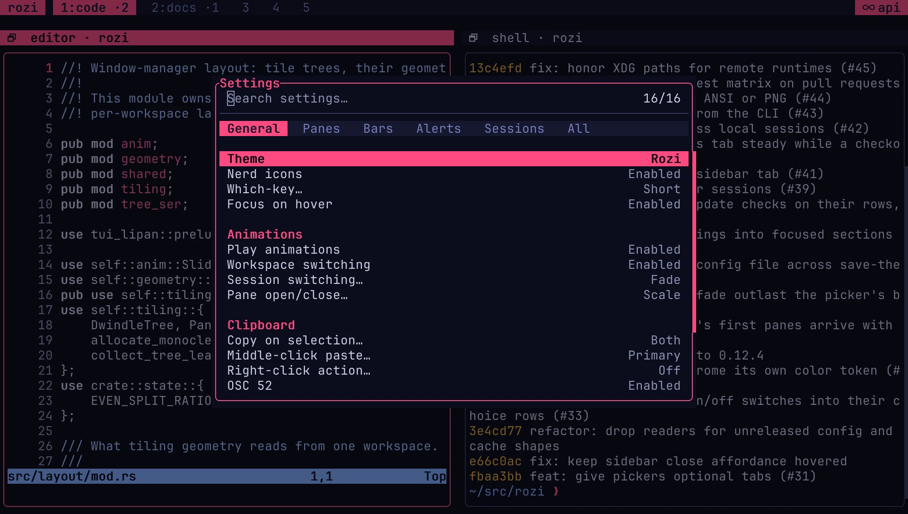
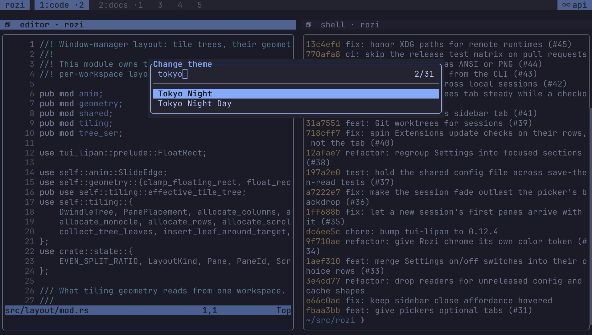
</CaptureGallery>

## Change the theme

rozi ships thirty built-in themes, including Catppuccin, Tokyo Night, Gruvbox, Nord, Rose
Pine, Kanagawa, and Everforest. Open **Settings**, choose **Theme**, and move through the list; the
whole interface and the colors inside your panes change as you go. Press `Enter` to keep a theme or
`Esc` to go back to the one you had.

```toml
[theme]
name = "catppuccin-mocha"
```

<CaptureGallery title="~/src/rozi — dev">

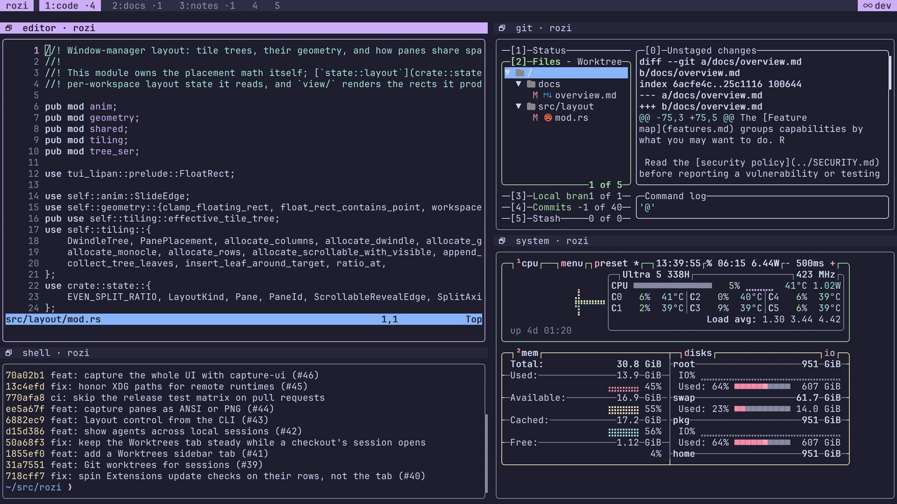
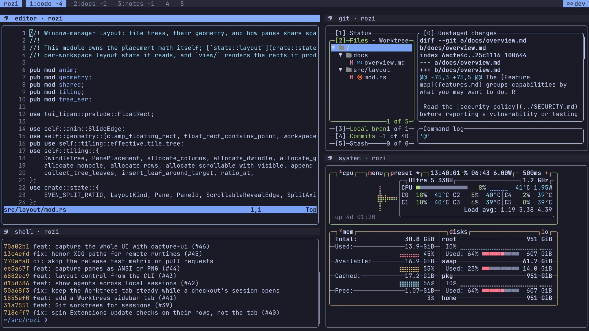
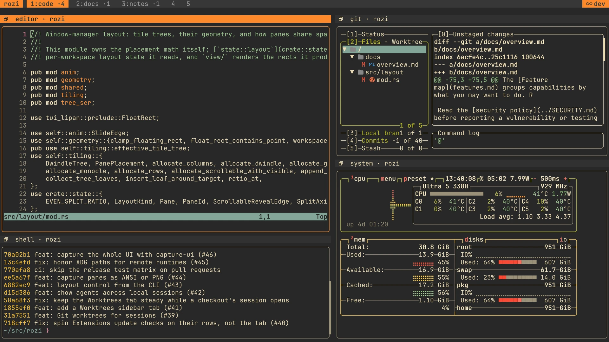
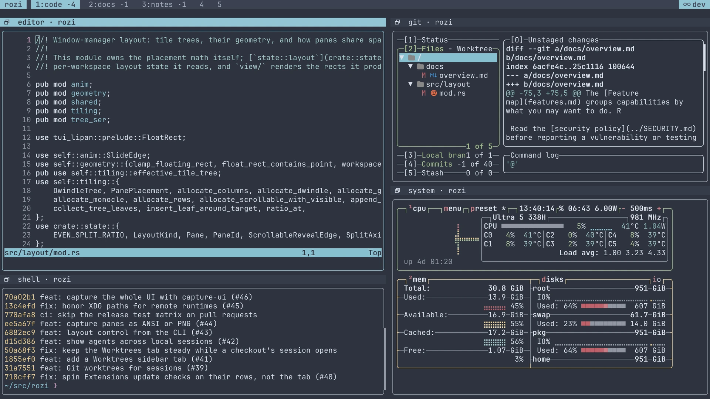
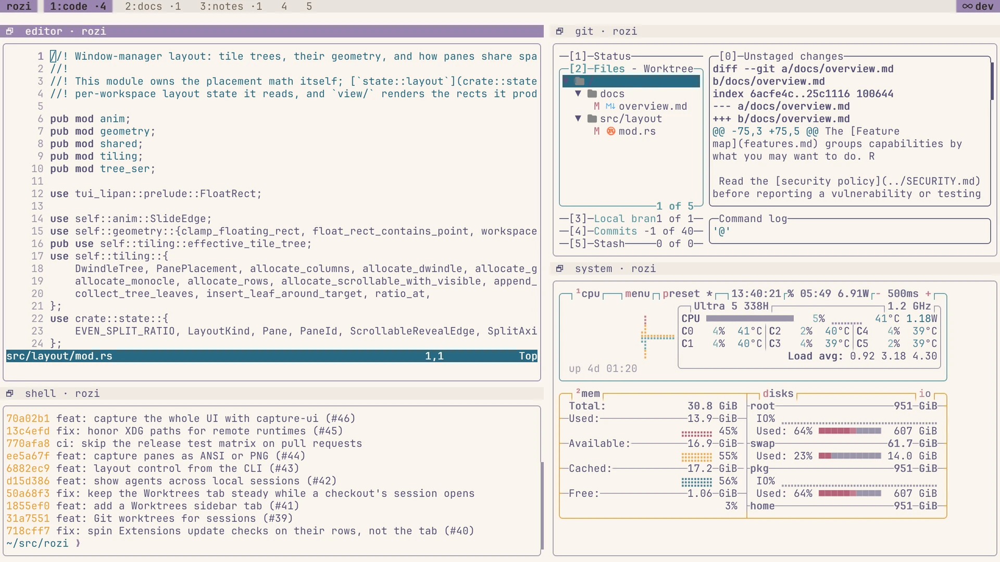
</CaptureGallery>

The programs in these panes use your terminal's 16 colors, so the theme recolors them too: the
editor, lazygit, and btop change along with rozi's own frames and bars.

Set `name = "system"` to follow your host terminal's colors; rozi updates when you change the
terminal's theme. To tweak a built-in theme instead, create a file in `~/.config/rozi/themes/` that
extends it and overrides only the colors you want:

```toml
# ~/.config/rozi/themes/my-nord.toml
extends = "nord"

[accent]
fg = "#ff79c6"
```

Then select `my-nord` in **Settings › Theme**. rozi reloads an active custom theme whenever you save
its file. See [Themes](themes.md) for the full list and the theme file reference.

## Choose a layout

Each workspace arranges its panes with a layout, and new workspaces start with the default one,
Dwindle.

| Layout | Arrangement |
| --- | --- |
| `dwindle` | Each new pane splits the focused one along its longer side. |
| `master` | One large pane on the left, the rest stacked on the right. |
| `grid` | A near-square grid. |
| `columns` | Equal full-height columns. |
| `rows` | Equal full-width rows. |
| `scrollable` | Full-height columns on a strip that scrolls to the focused pane. |
| `monocle` | One pane at a time, filling the workspace. |

<CaptureGallery title="~/src/rozi — web">
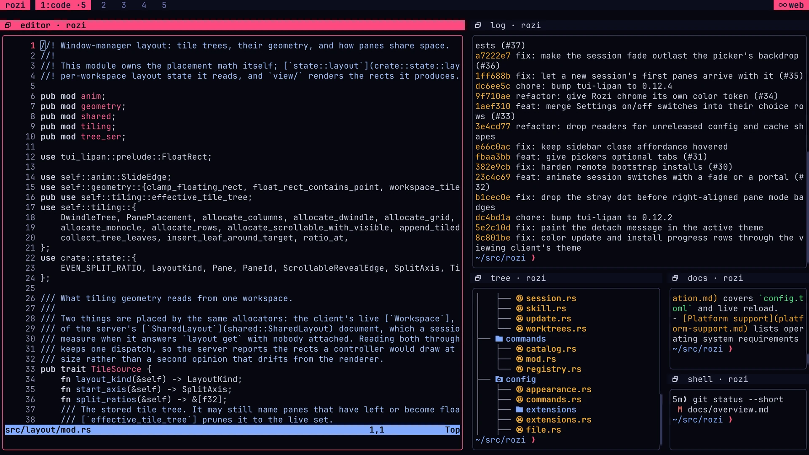
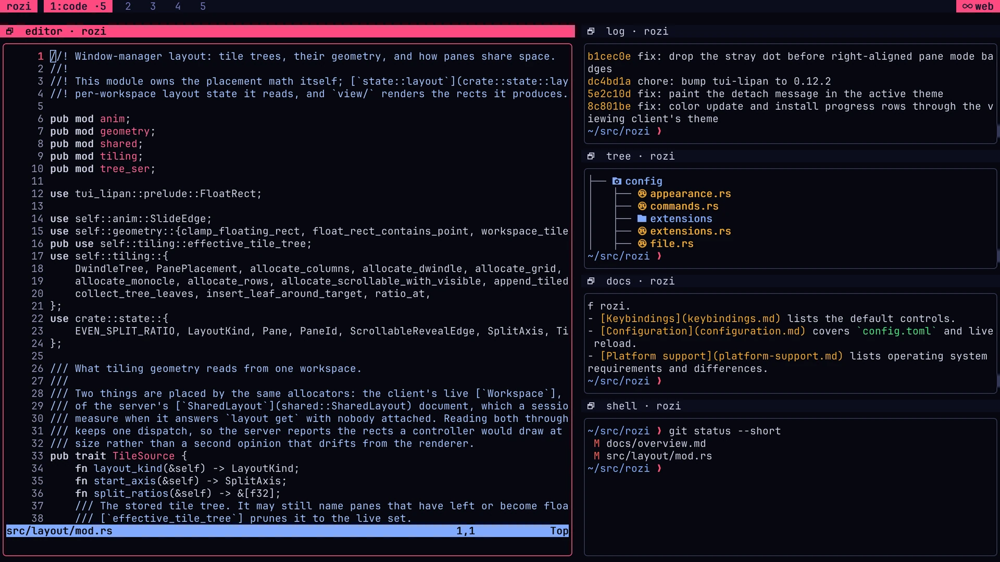
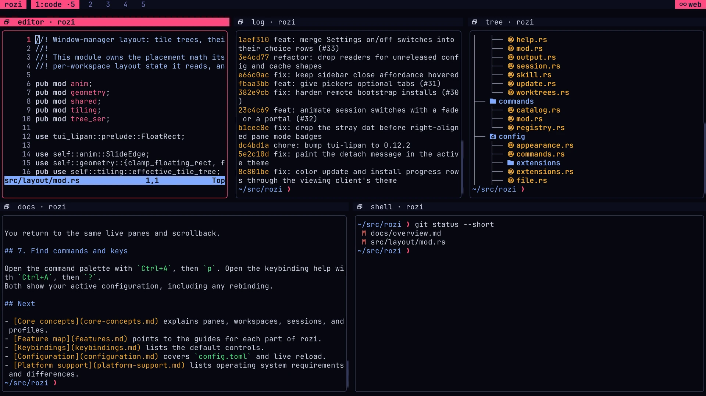
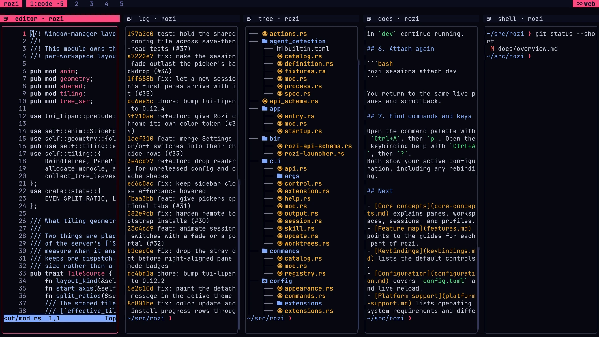
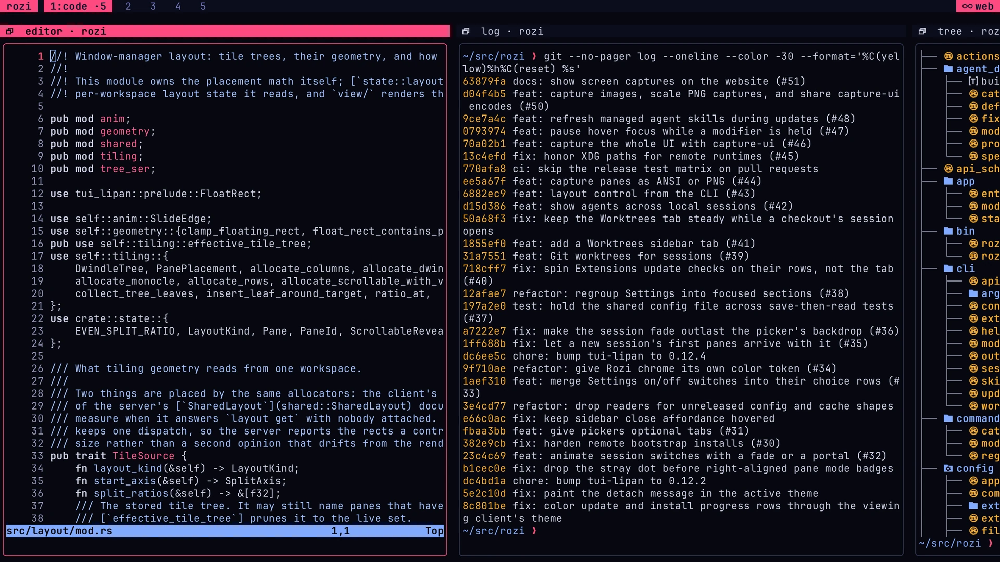
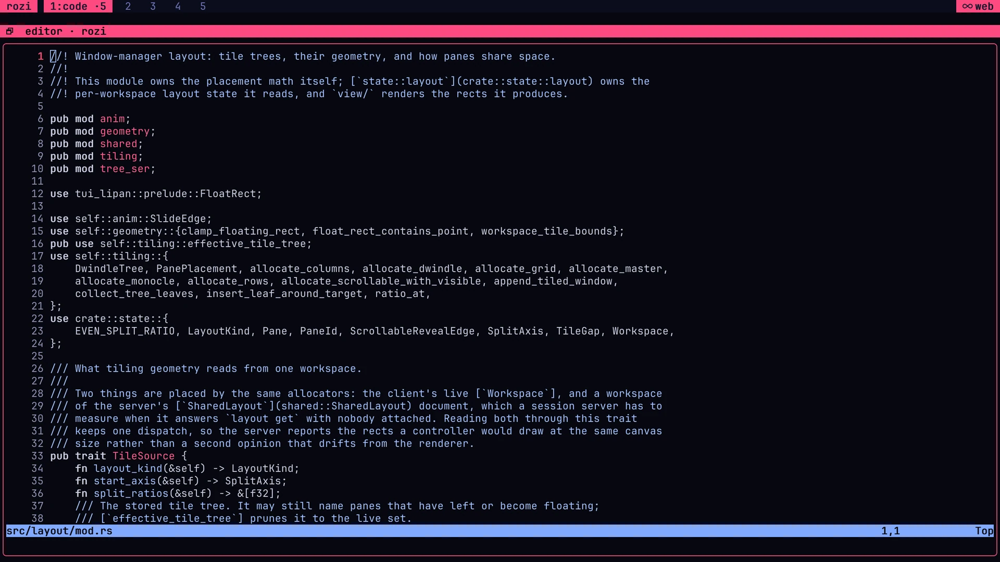
</CaptureGallery>

Press `Ctrl+A`, then `M` to open **Layouts**, which previews each one.
Press `Ctrl+F` there to make the highlighted layout the default. Or set it in the file:

```toml
[layout]
default = "master"
```

The `m` command key cycles the current workspace through the layouts. A
[profile](profiles.md) can set a different layout for each workspace. See
[Layouts and panes](layouts-and-panes.md) for how each layout behaves.

## Shape the panes

Most of rozi's look comes from a handful of `[pane]` keys. All of them are in **Settings › Panes**.

### Borders

`border_mode` decides whether panes have frames at all:

| Value | Look |
| --- | --- |
| `separate` | Each pane has its own frame. This is the default. |
| `merged` | Neighboring frames join and share their edges. |
| `dividers` | No frames, only lines between panes. |
| `none` | No borders at all. |

`border_style` picks the frame glyphs: `rounded` (the default), `plain`, `double`, `thick`, or one
of the dashed styles. Floating panes, the scratchpad, fullscreen panes, and pickers each have their
own style key, so a floating pane can stand out from the tiles beneath it.

```toml
[pane]
border_mode = "merged"
border_style = "thick"
float_border_style = "double"
```

### Titlebars

`titlebar` sets where each pane's title goes: `bar` puts it on its own row above the frame,
`border` and `integrated` draw it into the top border, and `inset` puts it on the first row inside
the frame. `title_style` shapes the title's ends: `padded`, `half`, `round`, or `arrow`. `round` and
`arrow` use [Nerd Font](https://www.nerdfonts.com/) glyphs, which rozi uses by default. Set
`show_titles = false` to hide titles and keep your chosen layout for later.

```toml
[pane]
titlebar = "integrated"
title_style = "round"
```

These keys combine into quite different looks. Each tab below is the same workspace with only the
lines shown changed:

<CaptureGallery title="~/src/rozi — dev">

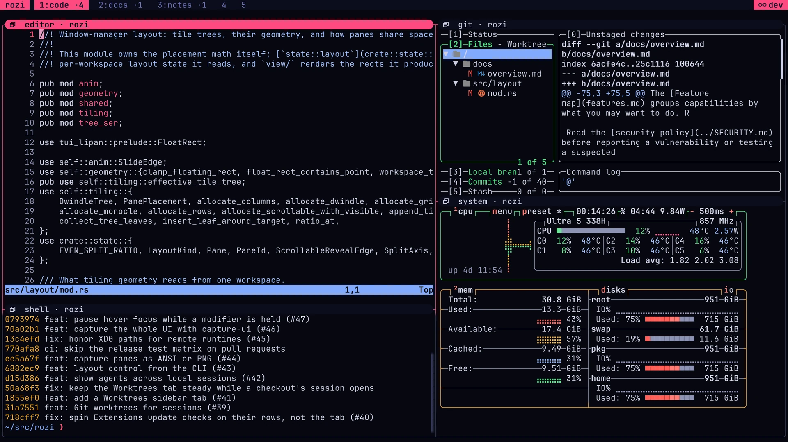
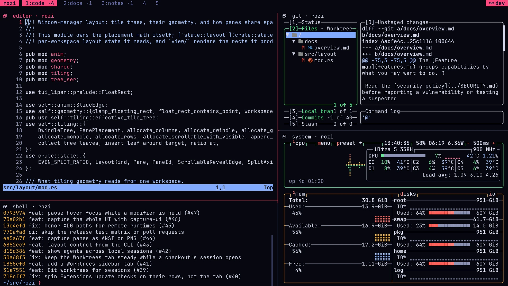
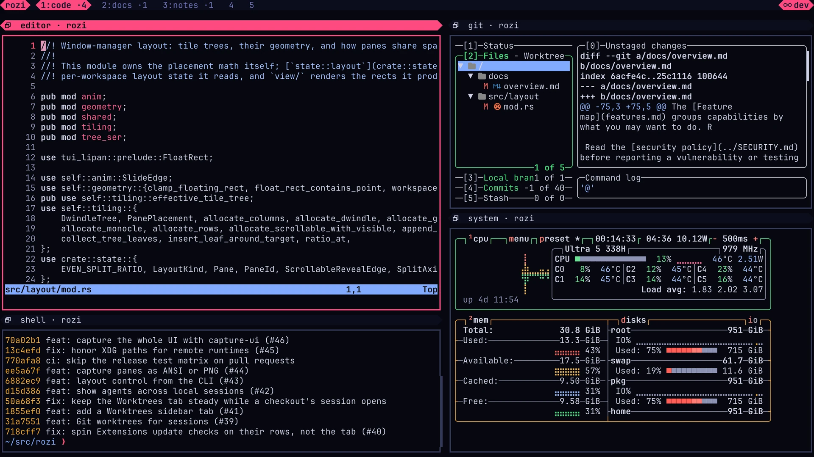
</CaptureGallery>

### Padding and background

`padding` adds empty cells between a pane's frame and its terminal. Give one value, a
`[vertical, horizontal]` pair, or all four sides; each side goes up to `8`. Set
`background_follows_terminal = true` to keep your theme but show your host terminal's background
behind the panes.

```toml
[pane]
padding = [0, 1]
background_follows_terminal = true
```

## Arrange the workbar and sidebar

The workbar is the strip that shows your workspaces, location, and session. Move it, space it, and
choose what it shows:

```toml
[pane]
workbar_at_bottom = true
workbar_gap = false
workbar_style = "round"

[workbar]
left = ["workspaces"]
right = ["activity", "clock", "session"]
clock_format = "%a %H:%M"
```

Segments can also be fixed text or the output of a shell command, such as
`"command:30:git branch --show-current"`. See [`[workbar]`](configuration.md#workbar) for every
segment.

The sidebar holds tabs for agent activity, panes, sessions, files, Git changes, and worktrees.
Toggle it with `Ctrl+A`, then `b`. rozi remembers its width, tab order, and panel split when you
change them with the mouse or keys. To choose where it sits and whether it opens at startup:

```toml
[sidebar]
visible = true
position = "right"
width = 36
tab_style = "round"
```

You can add your own sidebar tabs that launch commands or list a command's output. See
[Sidebar](sidebar.md#custom-tabs).

## Tune animations

rozi animates panes opening and closing, workspace and session switches, and focus changes. The
master switch turns everything off at once; **Settings › General › Animations** holds the same
controls.

```toml
[animations]
enabled = true
pane_style = "portal"   # off, scale, slide, portal, or scan
workspace_ms = 160      # 0 switches workspaces instantly
session = "portal"      # fade, portal, or off
```

Each pane style has its own timing and motion curve. See
[Pane open and close animation styles](layouts-and-panes.md#pane-open-and-close-animation-styles).

## Change keybindings

Most rozi commands have a command key that you press after the prefix `Ctrl+A`, or while holding
`Alt`. For example, `Ctrl+A`, then `w` and `Alt+W` both close a pane.

### In the Keybindings overlay

Press `Ctrl+A`, then `?` to open **Keybindings**. It lists every binding in effect, and you can
change any of them in place:

1. Type to filter, then select the command you want.
2. Press `Enter`, then press the new key or chord. On terminals with enhanced keyboard support,
   held modifiers appear as you press them.
3. Press `Enter` to save the binding, or `Esc` to record again.

If the key already belongs to another command, the card lists the conflict. Press `Enter` to take
the key anyway, or `Esc` to choose a different one.

<CaptureGallery mode="steps" title="Keybindings">

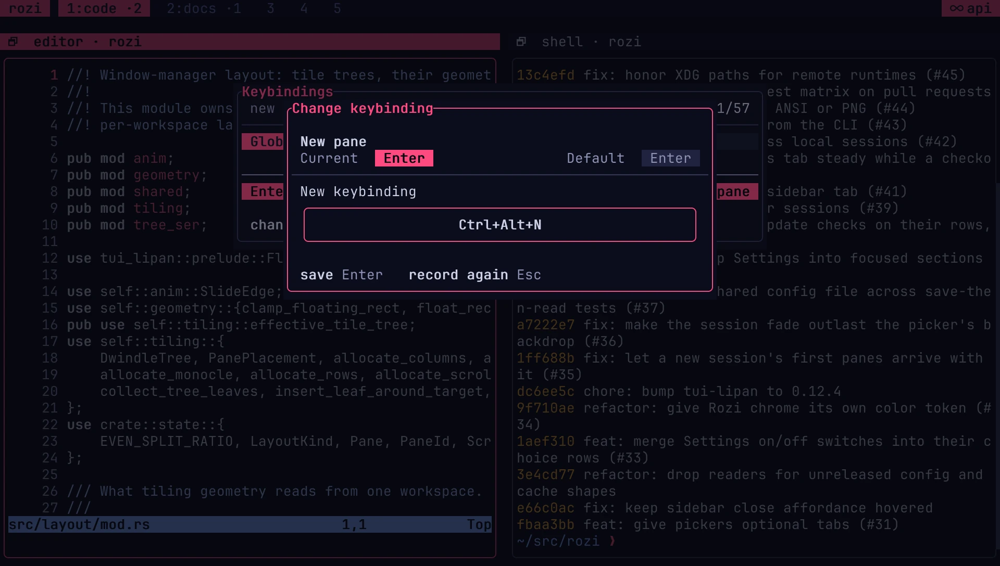
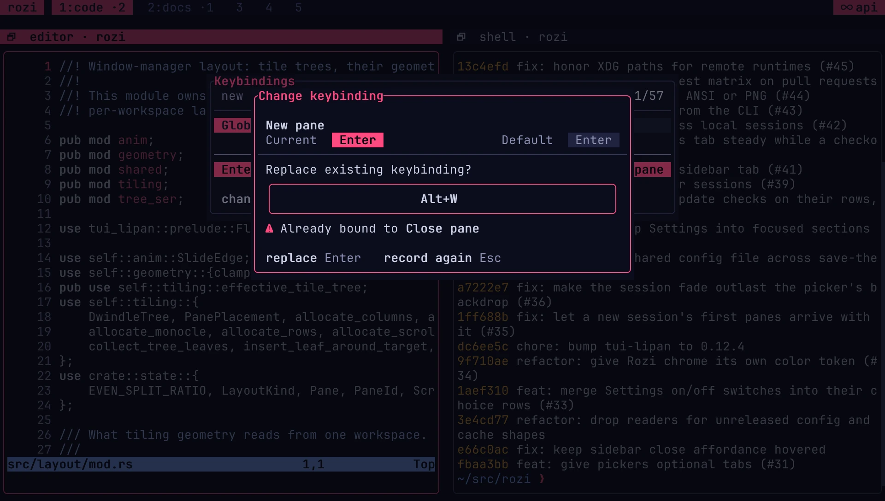
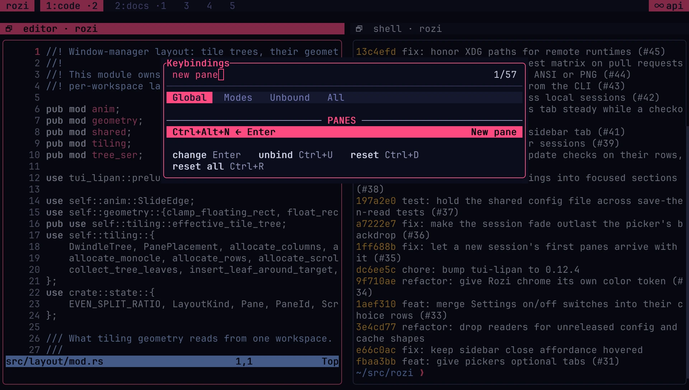
</CaptureGallery>

`Ctrl+U` unbinds the selected command, `Ctrl+D` resets it to its default, and `Ctrl+R` resets every
override after asking. The **Prefix** and **Mod** rows change the prefix key and the
held modifier; every command key moves with them. See
[Edit keybindings in rozi](keybindings.md#edit-keybindings-in-rozi) for the details.

### In config.toml

Bind a built-in action by its ID under `[keys]`. A bare key follows the prefix and modifier, so
`","` below works as both `Ctrl+A`, then `,` and `Alt+,`. A full chord is used exactly as written.

```toml
[input]
prefix = "ctrl-b"
modifier = "super"

[keys]
settings = ","
copy-mode = "b"
spawn = { add = "super-enter" }
g = { run = "lazygit", label = "Git UI", keep_open = false }
```

The last line binds `g` to a command of your own that opens `lazygit` in a new pane. Many desktop
environments reserve `Super`, so check yours before switching from `Alt`. See
[Rebind a command](keybindings.md#rebind-a-command) for all binding forms and the
[default command keys](keybindings.md#default-command-keys) for action IDs.

## A complete example

This file puts the ideas above together: a warm dark theme, a master layout, merged thick frames
with titles in the border, a bottom workbar with a clock, the sidebar on the right, and a few
personal keys.

```toml
cwd = "~/code"

[theme]
name = "gruvbox-dark"

[layout]
default = "master"

[input]
which_key = "instant"

[pane]
border_mode = "merged"
border_style = "thick"
float_border_style = "double"
titlebar = "border"
title_style = "round"
padding = [0, 1]
workbar_at_bottom = true
workbar_style = "round"
focus_on_hover = false

[workbar]
left = ["workspaces"]
right = ["layout", "clock", "session"]
clock_format = "%H:%M"

[sidebar]
visible = true
position = "right"
width = 34
tab_style = "round"

[animations]
pane_style = "slide"
workspace_ms = 160
session = "portal"

[keys]
settings = ","
g = { run = "lazygit", label = "Git UI", keep_open = false }
```

This is that file in use:

<CaptureGallery title="~/src/rozi — web">
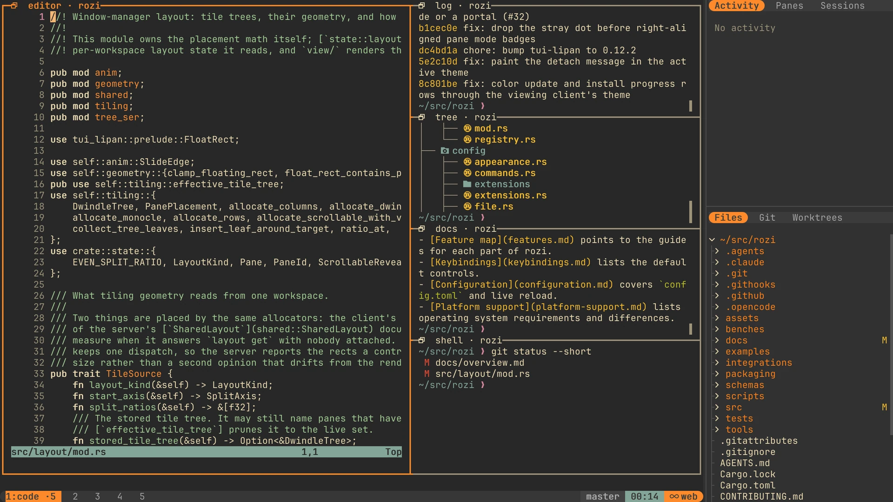
</CaptureGallery>

## Next steps

- [Configuration](configuration.md) is the full reference for every key.
- [Themes](themes.md) lists every built-in theme and documents theme files.
- [Keybindings](keybindings.md) lists every default key and binding form.
- [Profiles](profiles.md) saves workspaces, layouts, and startup commands to reuse.
