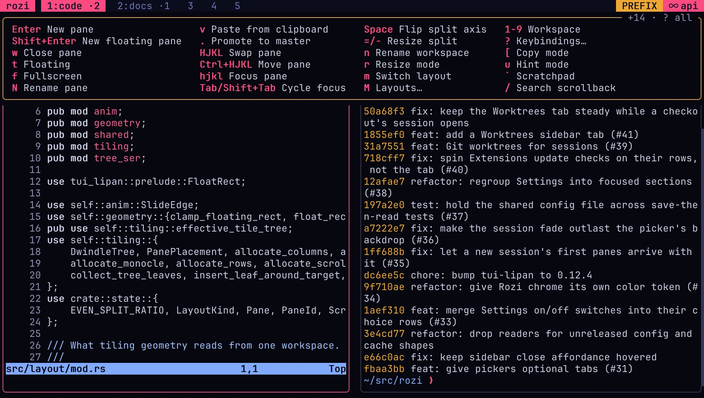
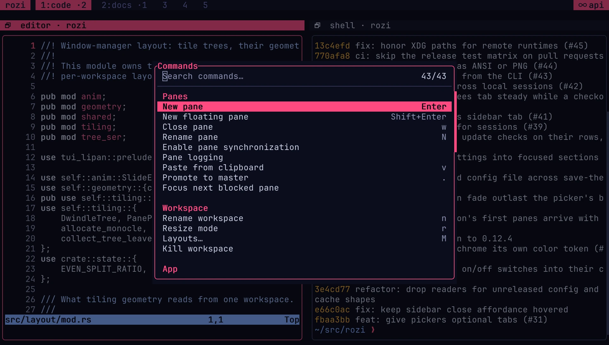

# Getting started

This guide takes about five minutes. You will create a named session, open a second pane, leave
the session running in the background, and return to it.

## 1. Install rozi

On Linux or macOS:

```bash
curl -fsSL https://rozi.tui-lipan.dev/install | bash
```

On Windows PowerShell:

```powershell
irm https://rozi.tui-lipan.dev/install.ps1 | iex
```

You can also use `cargo install rozi --locked` with Rust 1.90 or newer. See
[Installation](installation.md) for PATH setup, source builds, updates, and rollback.

## 2. Open the session picker

Run:

```bash
rozi
```

The session picker opens. Nothing is running yet: rozi waits for you to choose what to open.

The picker offers two kinds of session:

- A **named session** keeps running after you leave it, until you kill it. Use one for work you
  want to return to.
- A **temporary session** is for quick, throwaway work. Press `Enter` while the list is empty, or
  `Ctrl+T` once it shows sessions, to start one. It closes shortly after you leave it.

## 3. Create a named session

Type `dev` in the picker and press `Ctrl+N`. A new session named `dev` opens with a shell.

## 4. Work with panes

Most rozi commands start with the **prefix**, `Ctrl+A` by default. Press `Ctrl+A`, release it,
then press the command key.

Split the screen to open a second pane:

```text
Ctrl+A, then Enter
```

Move focus with:

```text
Ctrl+A, then h, j, k, or l
```

The directions follow Vim: left, down, up, and right. Holding `Alt` and pressing the command key
works too, so `Alt+L` moves focus right. See [Layouts and panes](layouts-and-panes.md) for layouts,
resizing, floating panes, and fullscreen.

## 5. Detach

Leave the named session running:

```text
Ctrl+A, then d
```

rozi exits, but the shells in `dev` keep running in the background.

## 6. Attach again

```bash
rozi sessions attach dev
```

You return to the same live panes and scrollback.

## 7. Find commands and keys

Open the command palette with `Ctrl+A`, then `p`. Open the keybinding help with `Ctrl+A`, then `?`.
Both show your active configuration, including any rebinding.

If you pause after pressing `Ctrl+A`, rozi shows the keys you can press next.

<CaptureGallery title="~/src/rozi — api">


</CaptureGallery>

## Next

- [Core concepts](core-concepts.md) explains panes, workspaces, sessions, and profiles.
- [Feature map](features.md) points to the guides for each part of rozi.
- [Keybindings](keybindings.md) lists the default controls.
- [Customize rozi](customize.md) walks through themes, layouts, pane styles, and keys.
- [Configuration](configuration.md) covers `config.toml` and live reload.
- [Platform support](platform-support.md) lists operating system requirements and differences.
