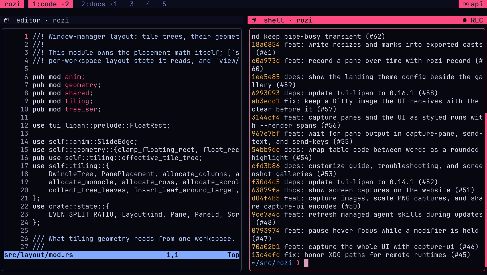
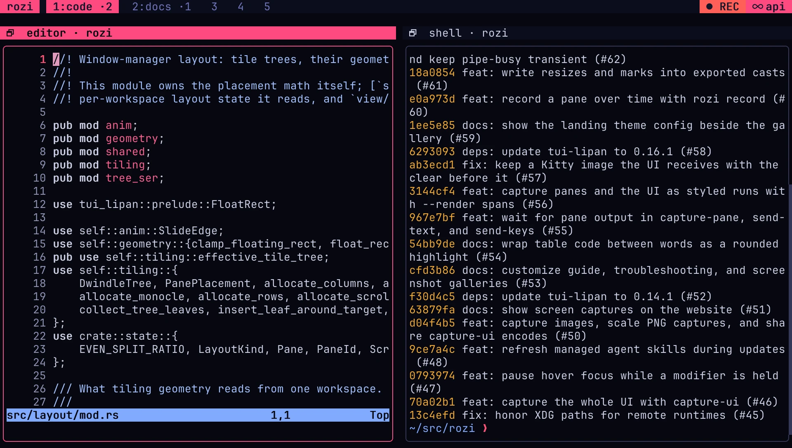
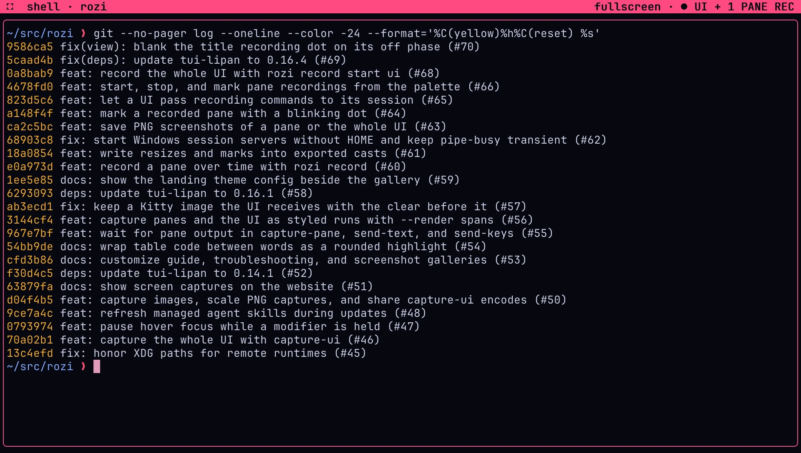

# Record a pane or the UI

`rozi record` records a pane's screen over time, change by change, to a file you can replay in a
terminal or export to PNG frames, a GIF, a video, or an asciinema cast. The session server does the
recording, so it runs with no UI attached: start one before you detach, and review what a coding
agent did overnight in the morning.

It can also record the whole rozi UI as you see it, chrome included, for a demo or a bug report.
See [Record the whole UI](#record-the-whole-ui).

## Record a pane

In rozi, open the command palette and run **Start pane recording**. It records the focused pane and
a toast says where the file is. Run **Mark pane recording…** to label the current moment, and
**Stop pane recording** to finish. The same commands work from the shell.

Name the session and the pane:

```sh
rozi --session dev record start pane --target 3
```

The command returns at once and the recording runs in the session server until you stop it. It
prints the file it writes to, which the server names; see [Where the file goes](#where-the-file-goes).
Pass `--output agent.rozirec` to name it yourself. Find pane ids with
`rozi --session dev list-panes`. Add a label to the current moment, see what is running, and stop:

```sh
rozi --session dev record mark "tests started"
rozi --session dev record list
rozi --session dev record stop
```

`record stop` answers once the file is complete. With more than one recording running, name one
with `--id`, from `record list`, or a pane with `--target`, which stops every recording of that
pane. `record mark` labels every running recording unless given `--id` or `--target`, and fails for
a recording that is already ending, so a mark it reports was written.

From a shell in a local session pane, leave out `--session`. The running rozi passes `start`,
`stop`, `list`, and `mark` to the session your pane belongs to, even after you switch to another
session. They act on the pane you run them in unless you give `--target` or `--id`. From outside
rozi, the commands go to the session on screen:

```sh
rozi record start
rozi record mark "tests started"
rozi record stop
```

The recording still runs in the session server, so it carries on after you detach. A scratch or
popup pane runs outside the session, so it cannot be recorded, and commands run in one need
`--session`. A pane of a [remote session](remote.md) runs on the other host, where it cannot
reach your rozi window, so it also uses `--session <NAME>`. A UI attached read-only can list
recordings but not start, stop, or mark one.

## Record from the command palette

| Command | What it does |
| --- | --- |
| **Start pane recording** | Starts recording the focused pane, with the file named by the server. |
| **Stop pane recording** | Shown instead while the focused pane records. Stops every recording of it. |
| **Mark pane recording…** | Asks for a label and marks the focused pane's recordings with it. |
| **Start UI recording** | Starts recording this whole UI, with the file named by rozi. |
| **Stop UI recording** | Shown instead while the UI records. |

The pane commands appear only when the focused pane can be recorded: the UI is attached to a session, it
is not attached read-only, and the pane is not a scratch or popup pane. **Mark pane recording…** also
needs the pane to be recording. When the mark lands, a toast says so and the recording dot flashes,
unless `[animations] enabled = false` or `focus_chrome = false`.

When a recording starts or stops, the toast shows the file path beneath its status. Right-click it
to copy the full path. When stopping several recordings, it copies all paths, one per line. For a
session on another host, the title names that host and the copied paths are on that host. A command
that fails shows why.

They have no default keys. Bind `toggle-pane-recording`, `mark-pane-recording`, or
`toggle-ui-recording` under
[`[keys]`](keybindings.md#rebind-a-command), for example to `Ctrl+A`, then `Shift+R`:

```toml
[keys]
toggle-pane-recording = "shift-r"
```

To record only while a command runs in the foreground, use `record pane`, which always needs
`--session`. It records until you press `Ctrl+C`. If the recording ends on its own first, such as when the pane's program exits, it prints
how it ended:

```sh
rozi --session dev record pane --target 3 --output demo.rozirec
```

Recording always starts from one of these commands. Nothing records in the background on its own.

## Record the whole UI

A UI recording holds every frame rozi paints in your terminal: the panes, borders, titles, the bar,
the sidebar, toasts, and any open overlay, as `capture-ui` would photograph them. It is taken on
your machine, like a screenshot, even when the session is on another host, and it lasts only as
long as that rozi runs.

In rozi, open the command palette and run **Start UI recording**. A toast says where the file is;
run **Stop UI recording** to finish. From a shell inside rozi:

```sh
rozi record start ui
rozi record mark --ui "opened the palette"
rozi record stop --ui
```

From another terminal, name the UI with `--socket`. `--session` does not apply: a session server
draws nothing to record. A relative `--output` is resolved against the directory you run `rozi` in,
because the UI writes on this machine. The limits and `--force` work as for a pane recording.

`record stop --ui` answers once the file is complete. There is no foreground form: `rozi record ui`
refuses, and suggests `record start ui` and `record stop --ui`.

rozi writes a frame only when it paints, so a UI that sits still costs nothing, and a UI that is
not recording does no recording work at all. Frames painted faster than `--max-fps` are merged: the
latest waits, and is written when the cap allows. A frame that changes one of the noted events
below is written at once. The recording also notes, with their times:

- your marks;
- the focused pane changing;
- switching workspace, with its number and name;
- an overlay, such as the palette or Settings, opening and closing.

The recording holds exactly what the terminal showed, so the `REC` indicator is in it too. Leaving
it out would mean drawing every frame a second time, and that frame would no longer be the one you
saw. Everything on screen is recorded, secrets included; see
[What a recording holds](#what-a-recording-holds).

A UI recording ends when you stop it, when it reaches its duration or size, or when rozi exits,
which waits up to five seconds for the file to be finished. Switching sessions does not end it.

## What a recording holds

A pane recording holds the pane's own terminal screen, the one `capture-pane --session` returns:
its text, colors, cursor, and the images programs displayed. It does not show anything rozi draws
around the pane, such as borders, titles, the bar, or overlays, and it looks the same whether or not
a UI is attached.

A frame is written only when the screen changes, so a pane that sits still costs nothing, and each
change is written at the moment it happened. `--max-fps` caps how often: changes that arrive faster,
such as an animation or a program flooding output, are merged into the latest screen for each
interval.

A recording also notes, with their times:

- your marks;
- title changes;
- commands starting and finishing, from [shell integration](terminal.md#working-directories-and-shell-metadata);
- the detected agent and its state, from [agent detection](agents.md);
- statuses set with `rozi status`;
- the pane's program exiting, with its status.

A recording contains everything the pane shows, including any secrets, tokens, or passwords that
appear on screen. Treat the file like the terminal it came from. rozi creates it readable and
writable only by you, and never replaces an existing file unless you pass `--force`.

## See that a pane is recording

<CaptureGallery title="~/src/rozi — api">



</CaptureGallery>

While a pane is recording, every attached UI marks it with `● REC` in the theme's error color at
the end of its title bar, after any `fullscreen` or `floating` badge: `fullscreen · ● REC`. A long
title is shortened before the marker, so the marker always shows. The dot blinks slowly, vanishing
and coming back while the text after it holds still; with `[animations] enabled = false` or
`focus_chrome = false` it holds steady. With `[pane] show_titles = false`, the dot sits in the
top-right corner of the pane's border instead, where it dims rather than leave a gap in the border.
A workspace tab carries a blinking dot while its workspace holds a recorded pane you cannot see: one
on another workspace, or one with neither a title nor a border to show it. A fullscreen pane covers
the other panes and the workbar, so its one marker counts the recordings it hides: `● 1 PANE REC`
while another pane records, or `● REC + 1 PANE` when it records too. A title never shows two dots.
The one exception: with `show_titles = false` and a `border_mode` of `"dividers"` or `"none"`, a
fullscreen pane has no title or border to carry the marker, so a recording shows only in
`list-panes` and `record list` until the pane leaves fullscreen. The indicator is rozi's own chrome,
so it never appears in the recording.

While the UI records itself, the bar shows a `REC` chip with a blinking dot, in the theme's error
color, just before its right-hand segments. The dot holds steady with `[animations] enabled = false`
or `focus_chrome = false`, and `REC` is always spelled out, so the chip never depends on color
alone. A fullscreen pane covers the bar, so while one is up its title carries the indicator
instead, after its badge: `fullscreen · ● UI REC`. It takes the place of the pane marker there,
with the same single dot, and counts any pane recordings too, the fullscreen pane's own included:
`fullscreen · ● UI + 1 PANE REC`. Only with no bar and no title to carry it (`[pane] show_workbar =
false`, or a fullscreen pane with `show_titles = false`) does the chip sit over the top-right corner
of the screen. Unlike the pane marker, this chip is part of
the recording.

`list-panes` reports `"recording": true` for the pane, `record list` shows the file and its
progress, and `metrics` counts recordings in its `recordings` section.

## Where the file goes

The session server writes a pane recording, so the path is on the session's host. A UI recording is
written by the UI, on your machine, into `[recording] dir` from your own configuration, named
`<session>-ui-<date>-<time>.rozirec`, or `rozi-ui-<date>-<time>.rozirec` with no session.

Without `--output`, the server names the file `<session>-pane-<id>-<date>-<time>.rozirec`, such as
`dev-pane-3-20260925-141503.rozirec`, and adds `-2`, `-3`, and so on rather than replace one that
exists. It writes into `[recording] dir` from the configuration on the session's host, or
`recordings` in the state directory there: on Linux, `~/.local/state/rozi/recordings`. A directory
rozi creates is readable only by you.

With `--output`, the directory must already exist. With `--session`, a relative `--output` is
resolved against the directory you run `rozi` in. With `--remote HOST --session NAME`, the file is
written on that host and a relative path is resolved against your login directory there, usually
your home directory. Without `--session`, `--output` must be absolute on the session's host, which
may run a different OS: a Windows session takes `C:\…`, a Linux or macOS one `/…`.

## Limits and how a recording ends

| Option | Default | Meaning |
| --- | --- | --- |
| `--max-fps N` | `30` | The most frames a second, from 1 to 120. |
| `--duration DUR` | `24h` | Stop after this long, such as `90s`, `8h`, or `1h30m`; at most `7d`. |
| `--max-bytes SIZE` | `1GiB` | Stop before the file grows past this size, such as `512MiB`; at least `64KiB`. |
| `--force` | off | Replace an existing file at `--output`. Needs `--output`. |

Change the defaults under `[recording]` in the configuration on the session's host, or for a UI
recording in the configuration of the UI. The session
server reads it each time a recording starts, so an edit applies to the next recording without a
restart. The palette commands always use these defaults.

```toml
[recording]
dir = "~/recordings"
max_fps = 15
duration = "8h"
max_bytes = "256MiB"
```

A value out of range is ignored with a warning, and the built-in default applies. See
[`[recording]`](configuration.md#recording).

A recording ends when you stop it, when it reaches its duration or size, when the pane's program
exits or the pane closes, or when the session is killed or its server stops. Its last event says
which. A foreground `record pane` also stops when the command exits, including when you press
`Ctrl+C` or its terminal closes.

The file is valid whichever way it ends. rozi writes it as it goes and flushes it at least once a
second, so a file cut short by a crash or a full disk still plays and exports up to its last
complete event.

If the disk cannot keep up, rozi keeps the latest screen rather than slowing the pane down, and the
end of the file counts the changes it skipped as `dropped`. The session never waits on a recording.

## Play a recording

`record play` replays a recording in your terminal at its own pace:

```sh
rozi record play agent.rozirec
rozi record play agent.rozirec --speed 4
rozi record play agent.rozirec --from "tests started"
rozi record play agent.rozirec --from 1h30m
```

`--from` starts at a mark, by its label, or at a time into the recording, on the screen as it was
at that moment. Playback lasts until the recording ended, holding the last screen for as long as it
stood still. It uses your terminal's colors, so make the terminal at least as large as the recorded
pane. Images play as the half-block approximations their cells hold; export PNG frames to see
them as recorded. Press `Ctrl+C` to stop.

## Export frames, a GIF, or a video

`record export --to png-frames` writes each frame as a PNG in the recording's colors, and a
`frames.ffconcat` listing that gives each frame its real duration:

```sh
rozi record export agent.rozirec --to png-frames frames --scale 2
```

`--scale` enlarges the frames, from 1 to 3. Hand the listing to [ffmpeg](https://ffmpeg.org) to make
a GIF or a video; rozi does not encode video itself:

```sh
ffmpeg -f concat -safe 0 -i frames/frames.ffconcat \
  -vf "split[a][b];[a]palettegen=stats_mode=diff[p];[b][p]paletteuse=dither=none" demo.gif
ffmpeg -f concat -safe 0 -i frames/frames.ffconcat \
  -vf "pad=ceil(iw/2)*2:ceil(ih/2)*2" -pix_fmt yuv420p -fps_mode vfr demo.mp4
```

`--to cast` writes an [asciinema](https://asciinema.org) cast, version 2, which plays in a browser
and keeps the text selectable:

```sh
rozi record export agent.rozirec --to cast agent.cast
```

A cast is text, so images appear as the half-block approximations their cells hold. Marks become
cast markers, which players list as chapters to jump to, and when the pane changes size the cast's
terminal changes size with it. Neither export replaces existing files unless you pass `--force`.

Export and play read the file on the machine you run them on and need no session.

## Cost

Recording runs beside the session without slowing it. The session server only notices a change
and takes the screen; a separate thread in the server turns it into the file. Measured with a
release build on Linux, a 120×32 pane, and the defaults:

| Pane running | Server CPU without | Server CPU recording | File growth | Frames a second |
| --- | --- | --- | --- | --- |
| An agent-like spinner, updating 10 times a second | 1.1% | 2.5% | 0.2 MiB a minute | 10 |
| `btop -u 100` | 1.6% | 5.6% | 5.7 MiB a minute | 11 |
| `seq` flooding output | 175% | 177% | 3.9 MiB a minute | 30 |

No change was dropped in any of these. A dashboard that redraws most of its screen costs the most
disk; set `--max-bytes` or `--max-fps` to bound a long recording of one.

## The file format

A recording is line-delimited JSON in the `rozi-recording` format: a header line, then one event per
line, with frames in the [`rozi-spans`](control-protocol.md#spans-frames) format. It is documented
in [Recording format](control-protocol.md#recording-format) and described by the
[JSON schema](control.md#json-schema), so other tools can read it.
