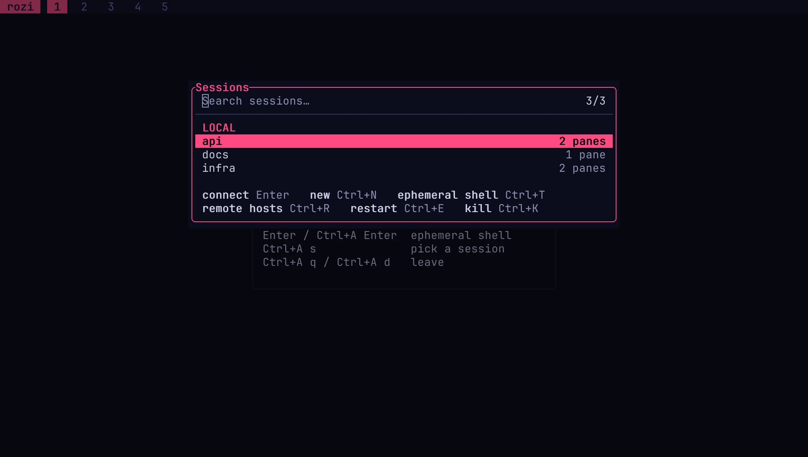

# Sessions

A session is a set of workspaces and panes that keeps running in a background session server. This
page covers opening, switching, naming, and leaving sessions, what happens at startup, and how rozi
restores sessions after the server stops.

By default, a bare `rozi` opens the session picker without creating or attaching to a session. From
there you choose a running session, restore a saved one, create a named session, or start a
temporary shell. The rozi window is a client of the session server, even for temporary work, which
is why a named session keeps its shells running after you leave. See
[Core concepts](core-concepts.md).

## Temporary and named sessions

| | Temporary | Named |
| --- | --- | --- |
| Typical use | Short work without choosing a name | Work you plan to return to |
| Leaving untouched | Closes | Keeps running |
| Leaving after use | Asks whether to name or close it | Keeps running |
| No clients attached | Closes after 45 seconds | Persists until killed |
| Picker label | `ephemeral` | Session name |
| Reattach after a client crash | During the 45-second recovery window | Until the session is killed |

Naming a temporary session renames its existing server. Panes and processes keep running.

## Open a session from the command line

```bash
rozi                         # open the default picker
rozi dev                     # attach to dev, or launch profile dev
rozi --session dev           # same target, explicit spelling
rozi sessions attach dev              # attach only
rozi sessions attach dev --read-only  # attach without input or layout authority
rozi sessions new dev                 # create a fresh empty named session
rozi sessions new review --profile dev
rozi sessions new api --cwd ~/src/api  # first pane starts in ~/src/api
rozi sessions list
rozi sessions kill dev
```

`rozi dev` attaches to a running session named `dev`. If there is none, it launches the profile
named `dev`. If neither exists, it reports an error; it never creates an empty session with an
unknown name. `rozi sessions kill <NAME>` also reports an error when no live or restorable session
has that name.

`--cwd` applies only to `sessions new` and cannot be combined with `--profile`. With `--remote`, it
names a directory on the remote host and is passed through unchanged, so use an absolute path.

Subcommand names and some retired command spellings cannot be bare session or profile targets. For
a session or profile literally named `attach`, use `rozi --session attach`.

`rozi sessions list --format json` includes an `origin` object for a session created from a profile
or a Git worktree. A worktree origin holds the checkout path on the session host. Restorable
sessions keep their origin.

Remote hosts use the same session commands. See [Remote sessions](remote.md).

## Use the session picker

Press `Ctrl+A`, then `s` to open **Sessions**.

<CaptureGallery title="rozi">

</CaptureGallery>

| Key | Action |
| --- | --- |
| `Enter` | Connect, switch to a background session, or restore a snapshot |
| Type a name, then `Ctrl+N` | Create and switch to a local named session |
| `Ctrl+K` twice | Kill a live session, forget a snapshot, or forget a `last seen` entry |
| `Ctrl+E` twice | Restart a live session with fresh panes |
| `Ctrl+W` | Disconnect this client from a background session |
| `Ctrl+X` | Disconnect a remote host |
| `Ctrl+R` | Open [Remote hosts](remote.md#manage-remote-hosts) |
| `Ctrl+T` | Open or switch to this client's local temporary shell |
| `Esc` | Return to the [sessionless launcher](#the-sessionless-launcher) |

A row can show that a session is attached in the background, shared with other clients,
restorable, or created from a profile. The list of local sessions refreshes while the picker is
open.

Opening Sessions never contacts a remote host. Sessions on remote hosts are listed from the last
time each host answered. Each remote group's header shows the host's state, and rows on a host this
client is not attached to are marked `last seen`, with the pane count the host last reported:

```text
REMOTE · workbox · disconnected
dev                                       3 panes · last seen
```

On a `last seen` row:

- `Enter` connects the host and attaches to the session.
- `Ctrl+E` is unavailable, because rozi cannot confirm the session is still running.
- `Ctrl+K` twice forgets the entry locally, without contacting the host. If the host still reports
  the session later, it is listed again.

To kill or restart a session on a remote host, connect the host first: press `Ctrl+R`, then choose
the host, or expand it in the Sessions sidebar.

## Scope: where an action happens

Each picker names the scope it acts in, and its keys act only in that scope.

| Surface | Scope | `Ctrl+N` | `Ctrl+T` |
| --- | --- | --- | --- |
| **Sessions** | Global — every host at once | New local named session | Local temporary shell |
| **Remote hosts** | Host management | Add a host | — |
| **Sessions · host** | That one host | New named session on the host | Temporary session on the host |

Sessions stays global even while a remote session is on screen. Attached to `backend@workbox`,
`Ctrl+N` in Sessions still creates a local session, and the footer reads `new local` whenever a
remote host is involved. To create a session on `workbox`, press `Ctrl+R`, choose the host, then
press `Ctrl+N`. See [Manage remote hosts](remote.md#manage-remote-hosts).

## Switch sessions

Switching to another session keeps the previous one connected in the background. Its panes keep
receiving output, so its screens and scrollback are current when you return. A background session
gives up layout control; returning to it takes control again when no other client has claimed it.
`Ctrl+W` in the picker disconnects a background session.

An untouched temporary session is discarded when you switch away. A temporary session you have used
stays in the background.

When you switch to a session this client has not opened yet, the previous session stays on screen
for a quarter of a second, and the Connecting screen appears only if the connection takes longer.
The incoming session then fades in. To use the portal effect or turn the effect off, change
**Settings** › General › Animations › Session switching, or `session` in
[`[animations]`](configuration.md#animations).

## Go to an agent

Press `Ctrl+A`, then `a` to open **Agents**. It lists coding agents in the current session, in other
running named local sessions, and on every
[connected host](remote.md#connected-host-monitoring), ordered by what needs attention: blocked,
then working, then done, then idle.

```text
Agents
 !  Codex · workbox/backend                              Blocked
 ⠋  Claude #2 · dev                                 Working · 4m
 ✓  Claude · api                                            Done
```

Each row names the agent and where it runs: the session name alone for the session on screen, and
`host/session` for anywhere else. Both parts are searchable, so typing a host name narrows the list
to that machine.

`Enter` goes to the highlighted agent. In the session on screen, it moves focus to the agent's pane.
Anywhere else, rozi attaches to that session first and then focuses the pane — and, for a program
running several agents, the agent's own row inside it. The host and session do not have to be open
already. A session already in the background switches in immediately.

Only agents in the session on screen show an age. Rows from other sessions show the agent's state
but no running clock. The agent's current activity, project, and branch, as shown in the
[Activity tab](sidebar.md#activity), need an attached session; see
[Agents on a machine you are not in](remote.md#agents-on-a-machine-you-are-not-in).

## Name or rename a session

Press `Ctrl+A`, then `S` to run **Name session** or **Rename session**. The same server, panes,
processes, and scrollback continue under the new name.

rozi rejects a name already used by a running session and names reserved for temporary sessions.

A profile is a launch recipe; a session is what is running. A session created from a profile
records that profile as its origin, but later edits to the profile do not change the running
session. See [Profiles](profiles.md).

## Leave rozi

`Ctrl+A`, then `q`, and `Ctrl+A`, then `d` run the same leave flow:

- Named sessions detach and keep running, including named sessions in the background.
- Untouched temporary sessions close without a prompt.
- Used temporary sessions open **Keep this session?**. Enter a name to keep the session running,
  submit an empty name twice to close it, or press `Esc` to go back.

Set `[confirm] quit_ephemeral = false` to close a used temporary session on the first empty name.

`rozi run-action quit` does not prompt and does not close a used temporary session. The temporary
server is left running so you can [recover it](#recover-a-temporary-session).

Killing the current session does not exit the client. rozi opens the picker if another session is
available, or returns to the sessionless launcher. Killing a named session also deletes its
[resurrection](#resurrection) snapshot.

## Choose startup behavior

`[session] startup` decides where rozi starts when you do not name a session:

| Value | Behavior |
| --- | --- |
| `picker` | Open the picker without attaching. This is the default. |
| `ephemeral` | Start a temporary shell immediately. |
| `last` | Reopen the most recently attached named session. |
| `profile` | Open the session named by `[profile] default`. |

A bare `rozi` applies this setting locally. `rozi --remote workbox` applies it on `workbox`:

| Value | `rozi --remote workbox` |
| --- | --- |
| `picker` | Connect, list sessions, and open `Sessions · workbox`. No session is created. |
| `ephemeral` | Create or attach a temporary session on `workbox`. |
| `last` | Attach the last session used on `workbox` if it is still there, else `Sessions · workbox`. |
| `profile` | Open or create the default-profile session on `workbox`, else `Sessions · workbox`. |

`last` is remembered separately for each host. It only reattaches a session that is still running;
it never restores or creates one. On a remote host, rozi opens `Sessions · workbox` and attaches the
remembered session only if the host still lists it, without waiting on SSH before drawing the first
frame. `profile`, by contrast, creates its session when needed.

A session you name explicitly — as a target, with `sessions attach` or `sessions new`, or through
`--pick` — overrides `[session] startup`. If `last` or `profile` cannot find its session, rozi opens
that host's picker and reports why.

### The sessionless launcher

When no session is attached, rozi shows the sessionless launcher. Press `Enter` to start a temporary
shell, or use the spawn command.

A launcher can be scoped to a remote host without a session or an open SSH connection there:

```text
REMOTE · workbox
Not attached. A shell starts on workbox.
```

You land here when you dismiss the picker after `rozi --remote workbox` with `startup = "picker"`,
or close `Sessions · workbox` with nothing attached. `Enter` then starts a temporary shell on
`workbox`. Sessions opened from this launcher is still global.

The scope follows the session you work in, so killing a remote session leaves you in that host's
launcher. Opening another host, disconnecting this one with `Ctrl+X`, or forgetting it changes the
scope. Browsing the host list or closing a picker without choosing does not.

## Recover a temporary session

If the client crashes or disconnects abnormally, a temporary session server waits 45 seconds after
its last client leaves. During that time, it appears as `ephemeral` in the picker and you can
reattach to it. After 45 seconds with no client, it shuts down, even if panes were still running.

Named sessions have no such timer. They persist until you kill them.

## Resurrection

With `[session] resurrect = true`, the default, rozi saves a snapshot of each named session
periodically and when the last client detaches after a change.

When the session server is no longer running, the picker lists a usable snapshot as `restorable`.
Restoring recreates:

- workspace layouts, names, and pane placement
- pane commands and working directories
- commands running inside a shell pane, including their arguments
- pane titles and terminal palette
- saved terminal history

Processes themselves are not saved. Each command starts again in a fresh terminal, with the saved
history shown above the new output. A missing directory, a missing history file, or a command that
fails to start affects only its own pane; the rest of the snapshot still loads.

To discard a snapshot, press `Ctrl+K` twice on its `restorable` row. `rozi sessions new <name>` also
starts fresh instead of restoring a snapshot with that name.

### Commands a pane was running

A pane created with a command, such as `rozi split -- btop` or a pane from a profile, restores by
running that command again.

A plain shell pane restores as a shell. If a command was running in it when the snapshot was taken —
an agent, an editor, a log tail, or a build typed at the prompt — rozi records the command with its
arguments and types it back into the new shell. When the command exits, you are left at the shell.
A pane sitting at a prompt records nothing, and prompt hooks such as directory jumpers are not
recorded as commands.

Some launchers are wrapper scripts that run under an interpreter, as Cursor's `agent` runs under
`node`. For recognized Node invocations, including Cursor's `--use-system-ca` launcher and Node's
`-r`/`--require` preload options, rozi keeps the arguments after the script. The script must be an
absolute path to an existing file beside the executable or the resolved launcher. Other
interpreters, unsupported options, and unresolved script paths restore by name only. Arguments the
wrapper itself adds after the script are also kept, because rozi cannot tell them from yours.

`[session] resurrect_foreground` decides what happens to a recorded command:

| Value | Restoring a shell that was running something |
| --- | --- |
| `auto` (default) | Types the command back and runs it. |
| `hold` | Types the command back and leaves it at the prompt. `Enter` runs it. |
| `never` | Restores the shell and its scrollback. No command is written to the snapshot. |

Use `hold` where re-running a command without asking, such as `terraform apply`, would be worse than
typing it again. The session server reads this setting when it starts and applies it to every
restore, so a server started with `never` also replays nothing from an older snapshot. To change
the setting for a running session, restart its server.

### Reopen an agent conversation

An agent that reports a native session reference (`rozi agents report --native-session`), and whose
definition declares `[agents.resume]`, restores into its previous conversation instead of starting a
new one.

The snapshot stores which agent and which reference, not a command. The resume command comes from
the agent definition loaded at restore time, so changed resume flags take effect, and an agent that
no longer declares resume support restores as an ordinary pane. The reference is passed as one
process argument, without shell parsing.

A pane restores the first of these that applies: a conversation to reopen, a command it was
running, the command it was created with, or a plain shell. Only one pane reopens a given
conversation.

`resurrect_foreground` applies here too:

| Value | Restoring a pane with a reported conversation |
| --- | --- |
| `auto` (default) | Runs the resume command as the pane's first process. |
| `hold` | Types the resume command at the shell's prompt and leaves it there. |
| `never` | Writes no conversation reference to the snapshot at all. |

If the resume command fails, the pane keeps the agent's error on screen, names the failure, and
leaves a usable shell below it. rozi never starts a new conversation in place of one it could not
reopen. From then on, that pane is saved and restored as a plain shell. A pane whose command simply
exited still restores by running the command again.

Set `[session] resurrect_agents = false` to keep agent session references out of snapshots. It
defaults to `true`. Only references reported by a live agent integration are saved, never values
read from terminal output.

## Scratch panes

The scratchpad belongs to the client, not to the attached session. Its panes run on a private
session server that lasts as long as the client, so scratch panes stay available while you switch
between local and remote sessions.

Scratch panes do not appear as a session. They are not shared with collaborators, saved in
profiles, or included in resurrection snapshots. Exiting rozi shuts down their server.

## Script a session with no client attached

A named session can be driven while no client is attached. Put a control command after
`rozi --session <NAME>`:

```bash
rozi --session dev list-panes
rozi --session dev capture-pane --target 3
rozi --session dev send-keys --target 3 'cargo test' Enter
rozi --session dev split --workspace 9 --argv cargo watch -x test
```

This does not attach a client, so the session's client count and layout control are unchanged. A
pane opened this way is already in place when a client attaches.

A script has no more authority than an attached client. `split` is refused while any client holds
layout control, and typing respects the session's input lock. Commands that need a screen — focus,
workspace switching, toasts, pickers, actions, and event subscriptions — are refused with a reason.
See [Control CLI](control.md#two-endpoints) for the full list and
[Automation recipes](recipes.md) for examples.

## Worktrees

rozi can open each Git worktree of a repository in its own named session, and create or remove
checkouts from the **Worktrees** picker or `rozi worktrees`. See [Worktrees](worktrees.md).

## Share a live session

More than one client can attach to a session. One client controls the shared layout, while each
client keeps its own focus, scrollback, overlays, theme, and sidebar. See
[Shared sessions](shared-sessions.md) for handing over control, read-only attachment, input lock,
and removing collaborators.

## Limits and failure cases

- `rozi sessions list` lists sessions it can connect to. Stale or unrecognized session entries are
  skipped.
- If a session server cannot be reached, the client reports the failure. It does not create a blank
  session with that name.
- If a client loses its connection to a local session, it reconnects in place, retrying a busy
  server for up to 15 seconds. If that fails, the client leaves the session and opens the picker or
  the launcher. The server and its panes keep running if the server is still alive.
- If a remote session's connection drops or stops answering, a reconnecting overlay retries for up
  to two minutes; `Esc` cancels it. rozi never silently replaces a remote session that is gone. See
  [Reconnection and switching](remote.md#reconnection-and-switching).
- A session server and client must be compatible. After upgrading rozi, restart an incompatible
  named session or update the other end.
- Restarting a session kills its processes and starts fresh panes. It is not the same as detaching
  and reattaching.
- A session name belongs to one host. The same name on the local machine and on a remote host
  refers to two different sessions.

See also [Troubleshooting](troubleshooting.md).
