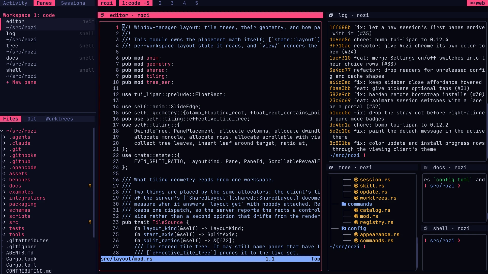

# Sidebar

The sidebar is a panel beside your panes with tabs for agent activity, panes, sessions, files, Git
changes, and worktrees. This page covers opening and navigating it, what each tab shows, and how to
configure tabs or add your own.

The sidebar belongs to your client. It is never part of a shared session layout.

<CaptureGallery title="~/src/rozi — web">

</CaptureGallery>

## Open the sidebar

Press `Ctrl+A`, then `b` to show or hide the sidebar. Press `Ctrl+A`, then `B` to show it and move
keyboard focus into its rows. `Esc` returns focus to the pane.

While the sidebar is visible, these command keys work without focusing it:

| Command key | Action |
| --- | --- |
| `PageDown` | Next tab |
| `PageUp` | Previous tab |
| `\` | Switch between one and two panels |

Switching to one panel keeps both panels' tab assignments, so switching back restores them.

Clicking a row runs its action without moving keyboard focus away from the pane. The sidebar is not
part of the normal `Tab` focus order.

## Navigate a focused sidebar

After the `B` command key focuses the sidebar:

| Key | Action |
| --- | --- |
| `j/k` or arrows | Move through selectable rows |
| `PageUp`, `PageDown` | Move by a page |
| `g`, `G`, `Home`, `End` | First or last row |
| `Enter` | Activate the selected row |
| `x` | Close the selected row; press again to confirm |
| `Tab`, `Shift+Tab` | Next or previous tab |
| `h/l`, arrows, `Space` | Collapse, expand, or toggle directories |
| `Ctrl+Shift+Left/Right` | Reorder the active tab |
| `Ctrl+Up/Down` | Focus the other panel |
| `Ctrl+Shift+Up/Down` | Move the active tab to the other panel |
| `Shift+Left/Right` | Resize the sidebar |
| `Shift+Up/Down` | Resize the panel split |
| `s` | Toggle one or two panels |
| `Esc` | Return focus to the pane |

With the mouse, drag the sidebar's outer edge to resize it, within the same 16 to 80 columns that
`width` allows. Drag the divider between panels to change the split.

rozi saves tab order, panel assignment, width, split state, and split ratio to `config.toml`.
Whether the sidebar is visible and which tab is selected are not saved.

## Activity

Activity lists detected coding agents and rows published with `rozi publish`. Rows are grouped by
the Git project that contains each pane's working directory, with branch and workspace context.
Selecting a row focuses its pane. For a published row, it also asks the program to show that
activity.

Each row shows `blocked`, `working`, `done`, or `idle` in its configured status colour. A finished
run stays marked `done` until you visit its pane. Agent state comes from the session server, so every
attached client sees the same thing.

Activity covers the session on screen. For agents in other local sessions and on connected hosts,
use the [Agents view](sessions.md#go-to-an-agent) (`Ctrl+A`, then `a`).

rozi ships definitions for common coding-agent CLIs. To add or override one, see
[Agent definitions](agents.md).

## Panes

Panes lists live panes grouped by workspace. Each row shows the pane title, foreground program, and
working directory. Activating a row switches to that workspace and focuses the pane. Each group ends
with **+ New pane**, which opens a pane on that workspace.

To close a pane, hover its row and click `x` twice, or select the row in a focused sidebar and press
`x` twice. This confirmation always applies, whatever your `[confirm]` settings.

Pane titles follow the order described in
[Layouts and panes](layouts-and-panes.md#titles-and-exited-panes).

## Sessions

Sessions lists local sessions and known remote hosts. Activating a live session attaches or
switches to it. Restorable sessions, and cached rows for offline hosts, stay listed when available.

Session names belong to their host, so a local `dev` session and a remote `dev` session are
separate rows.

Remote hosts add these rows:

- An offline host has a connect row.
- An online host has a disconnect row and a new-session row. Disconnecting detaches this client but
  leaves named sessions on the host running.
- A session on a connected host that you are not attached to shows what its agents are doing, such as
  `4 panes · 2 blocked`. See
  [Agents on a machine you are not in](remote.md#agents-on-a-machine-you-are-not-in).

The last row, **+ Connect a host…**, opens the same prompt as `Ctrl+N` in **Sessions → Remote
hosts**. rozi remembers a new host only after it connects successfully. A host is contacted only
when you expand or connect it, not when you open the tab.

To kill a session, hover its row and click `x` twice, or select it in a focused sidebar and press
`x` twice. Killing the session you are in leaves you in the session picker or the sessionless
launcher.

See [Sessions](sessions.md) for session management and [Remote sessions](remote.md) for host setup
and authentication.

## Files

Files browses the focused pane's working directory. It follows focus and `cd`, and directories load
when you expand them. rozi remembers which directories are expanded until the client exits.

Activating a file runs the tab's `on_click` action. By default, that types the path into the focused
pane without pressing `Enter`.

A symlink shows its target, as in `guide-link.md → AGENTS.md`. The target is the link's own text,
not a resolved path, and clicking the row acts on the link itself.

In a remote session, the listing comes from the remote host, and search covers only directories you
have already expanded.

## Git

Git shows changed files for the repository that contains the focused pane's working directory, with
status markers and line-change counts when available. It always shows the whole repository, even
when the pane is in a subdirectory.

Instead of an empty tree, the tab says when the repository is clean, when the directory is not in a
repository, when it is loading, or when changes are unavailable. In a remote session, `git` must be
on the remote host's `PATH`.

Files and Git refresh while they are on screen. They stop refreshing when you hide the sidebar or
switch both panels to other tabs.

## Worktrees

Worktrees lists the Git worktrees of the focused pane's repository, on the host running that pane's
session. A heading names the repository and host. Each checkout is listed by branch, with its folder
underneath when the folder name differs from the branch. A bar in the left margin marks the checkout
the focused pane is in.

The marker on the right shows whether a session was started from that checkout, using the same
markers as the Sessions tab:

| Marker | Session |
| --- | --- |
| `●` green | The one you are in |
| `◐` | Held by this client in the background |
| `●` | Running on the host; activating attaches to it |
| `○` | Saved; activating restores it |

A number after the marker counts the sessions using the checkout. `primary`, `locked`, or `prunable`
appears to its left when it applies. When you hover the row, the marker changes to what activating
it does: `attach`, `switch`, `restore`, `choose`, or `new session`.

Activating a checkout opens its session. If several sessions use it, you choose one. If none do,
rozi creates a session whose first shell starts in the checkout.

**+ New worktree** opens the new-worktree form. The checkout appears as `creating…`, and its session
opens when Git finishes.

To remove a linked checkout, hover it and click `x` twice, or select it in a focused sidebar and
press `x` twice. The branch is kept. If Git refuses because the checkout has uncommitted changes,
the row asks once more before forcing the removal. The primary checkout, locked checkouts, and
checkouts a session uses have no `x`.

The list follows the focused pane and refreshes along with the Git tab, so a checkout you add from
a shell appears without further action. See [Worktrees](worktrees.md) for the picker, the CLI, and
settings.

## Configure tabs and panels

```toml
[sidebar]
visible = false
width = 32
position = "left"
tabs = ["activity", "panes", "sessions", "files", "git", "worktrees"]
panels = [["activity", "panes", "sessions"], ["files", "git", "worktrees"]]
split = true
split_ratio = 0.5
background_follows_canvas = false
gap = true
background = true
tab_style = "padded"
```

| Key | Effect |
| --- | --- |
| `tabs` | Available tabs, by id. A repeated id is ignored after its first use. |
| `panels` | Which tabs go in the top and bottom panel. Without `panels`, all tabs share one panel. |
| `split` | `false` shows one panel but keeps both saved groups. |
| `position` | `"left"` or `"right"`. Also available under **Settings → Position**. |
| `background_follows_canvas` | Paint the sidebar with the canvas backdrop instead of the raised panel fill. |
| `gap` | Keep one blank row between each tab bar and its list. |
| `background` | Paint the tab strip as a distinct bar. When off, the strip matches the list below it. |
| `tab_style` | `padded`, `round`, or `arrow` — the same end caps as workbar tabs. |

When `background` is on, the tab strip uses a raised sidebar fill, or the `element` colour when
`background_follows_canvas` is on.

See [Configuration](configuration.md#sidebar) for defaults, size limits, file tree options, and
custom tab syntax. A complete example is in [`examples/sidebar.toml`](../examples/sidebar.toml).

## Custom tabs

You can add two kinds of tab of your own:

- A launcher tab lists configured entries. Each entry runs a `run`, `send`, or `popup` action, the
  same actions custom key commands use.
- A command tab runs a command and shows its output as rows.

Extensions can add tabs of either kind; see [Extension sidebar tabs](#extension-sidebar-tabs).

### Launcher tabs

An entry's `group` puts it under a section header like the ones in Activity, Panes, and Sessions.
Groups appear in the order they first occur, and entries without a group come first, without a
header. For example, a tab that starts an agent in a project, grouped by agent:

```toml
{ name = "agents", label = "Agents", entries = [
  { label = "rozi", group = "claude", run = "cd ~/Projects/rozi && claude" },
  { label = "rozi", group = "codex", run = "cd ~/Projects/rozi && codex" },
] }
```

### Command tabs

A command tab runs its command when the tab becomes visible, then again at its configured
interval. The interval is at least five seconds. Each run is limited to:

- a five-second timeout
- 64 KiB of combined output
- 500 rows
- 4096 characters kept per row
- 160 characters displayed per row

rozi strips terminal control sequences from the output. A command that fails to start, times out,
writes to standard error, or exits non-zero shows non-clickable error rows.

To group the output, set `group_prefix`. Each output line that starts with the prefix becomes a
section header showing the rest of the line. A line that is only the prefix is dropped. Headers
cannot be selected. `group_prefix` applies only to command tabs; launcher tabs use `group`.

A command tab runs in the focused pane's working directory, so it describes the project you are
working in and runs again when you `cd`. If the tab was off screen while you changed directory, it
shows its placeholder until the new result arrives, not the previous project's rows. With
`--remote`, the pane's directory is on the server, so the tab runs in the client's own directory.

### Pass the selected row or path

| Action | Tab | How the selection is passed |
| --- | --- | --- |
| `send` | Command | `{line}` in the text is replaced with the row |
| `run`, `popup`, `exec` | Command | `ROZI_ROW` environment variable |
| `send` | File tree | `{path}` in the text is replaced with the path |
| `run`, `popup` | File tree | `ROZI_FILE` environment variable |

`{line}` is the row after control sequences are stripped, sent literally — rozi does not quote or
evaluate it. `{line}` is rejected in `run` and
`popup`. When passing `ROZI_ROW` or `ROZI_FILE` to another program, quote it as `"$ROZI_ROW"` or
`"$ROZI_FILE"`. A row is command output and must never be used to build a command line.

### Extension sidebar tabs

Extensions add tabs with `[[sidebar_tabs]]` in their manifest, using the same launcher and command
forms. Their ids are `<extension>.<name>`. They start in the first panel until you move them, and
their placement is kept even while the extension is disabled or broken. See
[Extensions](extensions.md#sidebar-tabs).

### Security

Custom commands run as your user through the configured `command_shell`. Treat sidebar
configuration as executable code, and treat command output and filenames as untrusted input.

## Shared sessions

The sidebar's visibility, tabs, panels, selection, and cached data belong to each client. In a
[shared session](shared-sessions.md), the controller's sidebar still narrows the shared terminal
width, because the controller sets the size of the pane area everyone sees. A follower's sidebar
does not resize shared panes. See [Shared sessions](shared-sessions.md#terminal-size).
